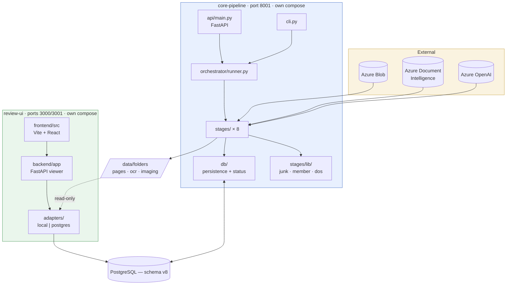
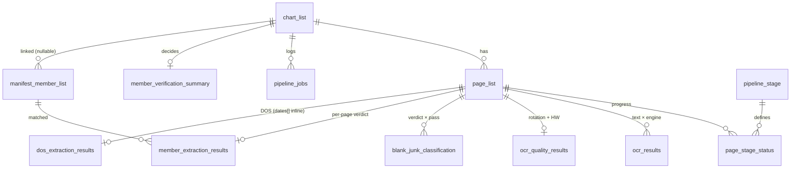

# Technical architecture

The shape of the system, the data model, and **what every file in the repository
is for**.

Companion documents: [FLOW.md](FLOW.md) (what runs when),
[LOGIC.md](LOGIC.md) (how each decision is made), [API.md](API.md) (how to run
and call it).

---

## Contents

1. [System shape](#1-system-shape)
2. [Data model](#2-data-model)
3. [The shared workspace](#3-the-shared-workspace)
4. [File inventory](#4-file-inventory) ← role of every file
5. [Design decisions](#5-design-decisions)
6. [Known limits](#6-known-limits)

---

## 1. System shape

Two independently deployable services over one database and one shared volume.



**Why no HTTP between them.** The review UI is a viewer over finished work. If
it called the pipeline it would need the pipeline up to render a chart the
pipeline finished last week. Sharing the database and the volume means either
service can be redeployed, scaled or taken down alone.

| | core-pipeline | review-ui |
|---|---|---|
| Deploys | `core-pipeline/docker-compose.yml` | `review-ui/docker-compose.yml` |
| Ports | 8001 | 3000 (API), 3001 (web) |
| `data/folders` | read-write | **read-only** |
| Database | required | Production Mode only |
| Scaling | one process per chart chain | stateless, scales freely |

---

## 2. Data model

Schema v8 — `schema/v1.sql` (implemented) and `schema/v2.sql` (next phase).



### Core tables

| Table | Grain | Role |
|---|---|---|
| `pipeline_stage` | stage × pass | **The pipeline's shape as data.** Order, labels, whether a stage is orchestrated. Adding a stage is an INSERT. |
| `chart_list` | chart | Identity + lifecycle `status` + `current_stage`/`current_pass`. `UNIQUE (chart_name)`. |
| `page_list` | page | One row per image. `image_sha256` gives download idempotency and image-level dedup. |
| `page_stage_status` | page × stage × pass | Progress. Replaces v6's 11 status columns. Drives resume and status derivation. |
| `manifest_member_list` | record × member | The client roster. Keyed on `record_id`; `chart_id` nullable so a sweep can precede ingest. |

### Result tables

| Table | Key | Written by |
|---|---|---|
| `ocr_results` | `(page_id, ocr_type)` | stages 1, 4, 5 |
| `ocr_quality_results` | `page_id` | stage 2. `hw_*` columns are the handwriting classifier's real output; `quality_tag`/`quality_score` are placeholders until a quality model exists. |
| `blank_junk_classification` | `(page_id, pass_no)` | stages 3, 6 |
| `member_extraction_results` | `page_id` | stage 7 |
| `member_verification_summary` | `chart_id` | stage 7 |
| `dos_extraction_results` | `page_id` | stage 8. Page/document pairs are single-valued columns; every date found sits in the `dates` JSONB array. |
| `pipeline_jobs` | run | every stage |

### Views

| View | Purpose |
|---|---|
| `v_chart_stage_progress` | Per-chart per-stage page rollup. Chart status reads this. |
| `v_page_blank_junk_final` | The one winning blank/junk row per page. |
| `consolidated_chart_results` | One wide row per chart for reporting. |
| `pipeline_stage_performance` | Stage timings and success rates. |

### Constraints that carry meaning

| Constraint | Prevents |
|---|---|
| `chart_list UNIQUE (chart_name)` | Two concurrent ingests creating two charts with one name. |
| `blank_junk UNIQUE (page_id) WHERE is_final` | Two "final" verdicts for one page. |
| `junk_subtype CHECK` | A label the UI cannot render reaching the database. |
| `page_stage_status UNIQUE (page_id, stage_name, pass_no)` | Duplicate progress rows; makes upsert-on-conflict safe. |
| `manifest` two partial unique indexes | Duplicate roster rows, with and without a MemberID. |

### Tables present but not yet written

`page_classification`, `chunk_results`, `encounter_type_results`,
`page_sequencing_results`, `rejection_results`, `provider_signature_results`,
`invoice_matching_results`, `ground_truth_csv`, `model_registry`,
`field_accuracy_log`, `model_accuracy_snapshots`, `manual_review`, `audit_log`,
`users`.

`manual_review` / `rejection_results` / `audit_log` / `users` are the review-write
phase, deliberately not built — the UI is a viewer. The rest are registered in
`pipeline_stage` with `is_phase1 = FALSE`, so they sit outside the status rollup
until their stage modules land.

---

## 3. The shared workspace

```
review-ui/data/folders/<chart_name>/
├── pages/
│   └── 1.jpg … N.jpg              written by intake; served by review-ui
├── ocr/
│   ├── <chart>_prelim.txt         ===== <page> ===== delimited blocks
│   ├── <chart>_final1.txt         same format
│   └── <chart>_final2.json        {recordId, pageCount, pages[{fileName, content}]}
└── imaging/
    ├── <chart>_rotation.csv
    ├── <chart>_hw_printed.csv
    ├── <chart>_junk.csv
    ├── <chart>_member_extraction.csv
    ├── <chart>_member_verification.csv
    ├── <chart>_member_v1_compare.csv    reference column order, for diffing
    └── <chart>_dos.csv
```

Everything here is **rebuilt from the database** each run, so a resumed run never
leaves a half-written file.

The `===== <page_name> =====` marker is a real contract: the DOS driver's
`UI_PAGE_MARKER_RE` splits on exactly it. Pinned by
`tests/test_contracts.py::test_dos_splitter_reads_the_same_marker`.

**Precedence in review-ui Local Mode:** per-chart `imaging/*.csv` first, then the
legacy combined packs (`01-ocr-extraction/output/…`) from the older pipeline.
Per-chart always wins; the fallback exists so pre-existing `05-imaging-ui` data
still renders.

---

## 4. File inventory

### Repository root

| File | Role |
|---|---|
| `PLAN.md` | Living architecture plan: status, decisions, phases. Update in the same change set as an architecture change. |
| `README.md` | Short orientation; detail lives in `docs/`. |
| `.gitignore` | Excludes venvs, caches, `node_modules`, `dist`, and macOS `._*` / `.DS_Store` droppings. |
| `docs/` | This documentation set. |

### `schema/`

| File | Role |
|---|---|
| `v1.sql` | **What is implemented.** 12 tables + 2 views, every one written or read by running code. Required. Stands alone — references nothing in v2.sql. |
| `v2.sql` | **Next phase. Nothing implemented.** 14 tables + 3 views, plus the four unorchestrated `pipeline_stage` rows. Optional; apply after v1.sql. Treat each table as a proposal, not a contract. |

### `core-pipeline/` — top level

| File | Role |
|---|---|
| `config.py` | Every environment-driven setting in one place: database URL, data roots, Azure credentials, feature flags (`MEMBER_NER_ENABLED`, `DOS_LLM_ENABLED`), `STAGE_WORKERS`, and the `chart_dir` / `pages_dir` / `ocr_dir` / `imaging_dir` path helpers. |
| `cli.py` | Command-line entry: `serve`, `ingest`, `register-local`, `run`, `stages`, `status`, `manifest`. Everything the API does, without the HTTP hop. |
| `requirements.txt` | Python dependencies for the service. |
| `requirements-ner.txt` | **Optional** GLiNER runtime (`gliner`, `torch`, `transformers`, ~2.5 GB). Separate so the base image stays small; `docker build --build-arg WITH_NER=true` includes it. |
| `Dockerfile` | Runtime image. Installs Tesseract and the OpenCV/ONNX system libraries the reference modules need. |
| `docker-compose.yml` | Standalone deployment: ports, env, and the four volume mounts. |
| `.env.example` | Documented template for `.env`, with the consequence of leaving each optional service unset. |
| `__init__.py` | Package marker. |

### `core-pipeline/api/`

| File | Role |
|---|---|
| `main.py` | FastAPI app. Request models, the async 202 pattern, and the endpoints: `/health`, `/ready`, `/api/stages`, chart ingest / register-local / status / rerun, manifest sweep and lookup, `/api/jobs`. Closes the connection pool on shutdown. |
| `__init__.py` | Package marker. |

### `core-pipeline/orchestrator/`

| File | Role |
|---|---|
| `runner.py` | `STAGE_CHAIN` — the eight stages in order — plus `run_pipeline_for_chart` (resume, `force`, `only`) and `ingest_and_run`. Refreshes chart status after each stage; aborts the chain on a stage exception, because every later stage reads what the failed one produced. |
| `__init__.py` | Package marker. |

### `core-pipeline/db/`

| File | Role |
|---|---|
| `__init__.py` | **The persistence layer.** Connection pool, `connect()`, hashing helpers, and every read/write: chart and page upserts, the `page_stage_status` helpers (`init_page_stages`, `set_page_stage`, `pages_needing_stage` ← resume), job rows, and one upsert per result table. All `ON CONFLICT`, never SELECT-then-UPDATE. |
| `chart_status.py` | Derives `chart_list.status` / `current_stage` / `current_pass` from `v_chart_stage_progress`. `compute_progress()` is pure, so it is directly testable. |
| `paths.py` | The disk contract: local page listing, the `===== page =====` combined-text writer/parser, the final2 JSON writer/parser, CSV write/append, and `imaging_csv()` naming. |
| `blob_store.py` | Azure Blob access: auth (Entra / key / connection string), `list_image_blobs`, `download_blob_to_path`, `chart_name_from_blob_path`. |

### `core-pipeline/jobs/`

| File | Role |
|---|---|
| `manifest_sweeper.py` | Batch manifest loader. Parses CSV/XLSX from a file, directory or blob prefix; recognises the column aliases; splits name parts; derives `run_id`/`batch_id` from the `R#_B#` filename; upserts on `record_id`. Creates no placeholder charts. |
| `__init__.py` | Package marker. |

### `core-pipeline/stages/` — the eight stages

| File | Role |
|---|---|
| `_support.py` | Shared stage plumbing: the `stage_run()` context manager (job row, page load, resume set, job close), `mark_processing` / `mark_completed` / `mark_failed` / `mark_skipped`, and the shared eligibility rule. Keeps each stage about its actual work. |
| `download_blob.py` | **Intake.** Upserts the chart, downloads page images (skipping bytes already on disk), records SHA-256 + size, seeds `page_stage_status`, links manifest rows swept earlier. Also `register_local_pages()` for folders already present. |
| `ocr_prelim_tesseract.py` | **Stage 1.** Tesseract over every page, threaded to `STAGE_WORKERS`. Writes `ocr_results` and rebuilds `_prelim.txt`. |
| `quality_rotation_hw.py` | **Stage 2.** Rotation and handwriting per page, using the reference detector and classifier — each built once per process. Writes `ocr_quality_results` and the rotation / hw CSVs. |
| `blank_junk_classify.py` | **Stages 3 and 6.** Both passes: eligibility, the cross-pass duplicate fingerprint table, the subtype mapping into the schema's constrained vocabulary, `mark_blank_junk_final`, and a full CSV rewrite from the database. |
| `ocr_final1_docling.py` | **Stage 4.** RapidOCR (Tesseract fallback), engine built once. Stores as `ocr_type='docling'` — the UI's "Final (OSS)" slot. |
| `ocr_final2_azure.py` | **Stage 5.** Azure Document Intelligence `prebuilt-read`, one shared client. The billed stage, so the resume path matters most here. Stores the page document as JSON. |
| `member_extract_verify.py` | **Stage 7.** Plumbing around the ported engine: picks the manifest row, chooses eligible pages, assembles the best text per page, runs `verify_record`, persists page rows and the summary, writes three CSVs including the reference-shaped comparison file. |
| `dos_extract.py` | **Stage 8.** Builds the marker-delimited text, calls the reference driver `detect_dos_per_page` (regex → LLM → carry-forward), persists the primary pair plus every date, writes the DOS CSV. |
| `__init__.py` | Package marker. |

### `core-pipeline/stages/lib/junk/` — blank/junk classifier

Ported from `advantmed-imaging-ui/02-imaging-pipeline/junk-classification/`.

| File | Role |
|---|---|
| `classify.py` | The entry point: `classify_text()` tries each detector in priority order and returns a code; also the code constants, labels, `fingerprint()` and confidences. |
| `classify_junk.py` | The fuller CLI-era classifier retained from the reference. |
| `blank.py` | Blank detection: empty OCR, declared-blank phrasing, near-empty image. |
| `invoice.py`, `cover.py`, `record_request.py`, `instructions.py`, `letter_fax.py` | One junk category each. |
| `others.py` | Catch-all: gibberish OCR, signature-only pages. |
| `text_utils.py` | Shared text predicates — word count, gibberish, signature page. |
| `requirements.txt` | Dependency list inherited from the V1 prototype (the modules are pure stdlib). |
| `__init__.py` | Package marker. |

### `core-pipeline/stages/lib/member/` — member verification

Ported from the V1 `Member_Verification/` tree. **Logic is verbatim; only
imports changed** (relative imports instead of the reference's `sys.path`
inserts).

| File | Role |
|---|---|
| `engine.py` | The port of `run.py`'s decision flow: `extract_page_fields` (rules → NER escalation), `verify_page`, `classify_page`, `document_verified`, and `verify_record` which drives a whole chart. Also `expected_from_manifest`, `detect_name_mode`, `summary_status`, and `page_result_to_v1_row` for diffing against a V1 run. |
| `__init__.py` | Public surface for the stage. |
| **`rules/`** | |
| `base_rules.py` | `combine_evidences` — the name+DOB/ID acceptance rule — and `is_present` (treats `"N/A"` as absent). |
| `name_2_words_rules.py` | Two-word verification: full match, or initial-only which needs both corroborators. |
| `name_3_words_rules.py` | Three-word verification: all three or two of three. |
| `wrong_member_rules.py` | `wrong_member_on_page` — true when NER read names off the page and none is the expected member. The only route to a `Reject`. |
| `what_if_rules.py` | Page buckets (`Verified` / `Wrong_Member` / `Not_Verified`), `reject_threshold` = `min(5, ceil(10%))`, and `apply_what_if` → Accept/Reject. |
| `__init__.py` | Re-exports the rule surface. |
| **`extractors/rule_based/`** | |
| `name_common.py` | The heart of name matching: tokenising, ignore/label/non-name vocabularies, `classify_two_word_name` / `classify_three_word_name` (including the `ONE_FULL_WRONG` "different member" case), and the sliding-window `_best_span` search. |
| `name_2_words.py`, `name_3_words.py` | Thin wrappers over the span search. |
| `dob.py` | Finds the expected DOB's three parts adjacent in any supported order; `date_parts_match` is reused by the NER pass. |
| `member_id.py` | Exact MemberID match with boundary guards, so a substring of a longer token does not count. |
| `__init__.py` | Re-exports the four extractors. |
| **`extractors/ner_based/`** | |
| `keys.py` | Cuts the real sentence around a field key out of the page ("Patient Name: Robert Smith"), with the reach-across-a-gap rules. NER reads real text, not rebuilt tokens. |
| `key_groups.json` | The key phrases per field group (patient_name, date_of_birth, member_id). |
| `name.py` | Runs NER on each patient-name sentence, merges adjacent person spans, trims label words, and picks the best candidate. Returns *every* person found, so the caller can also spot a wrong member. |
| `dob.py`, `member_id.py` | Second-pass DOB / MemberID from NER over their key sentences. |
| `model.py` | Model loading and prediction: offline mode, retries, fail-loud on an unloadable model, GLiNER and HF-token backends. Short-circuits when the layer is disabled. |
| `catalog.py` | The three GLiNER checkpoints and the on-disk relinking that makes them load offline. Weights directory is configurable. |
| `config.py` | NER toggles: `MEMBER_NER_ENABLED`, per-model flags, checkpoint path. |
| `log.py` | Per-hit NER log rows (sentence, value, span, confidence) for auditing a decision. |
| `__init__.py` | Re-exports the three NER extractors. |
| **`extractors/ner_based/model_downloader/`** | |
| `_common.py` | Hugging Face snapshot download with retries, plus two-stage verification: every file present and non-empty, then an actual load and one prediction — a snapshot can complete and still not load. |
| `gliner_large_v2_1.py`, `gliner_medium_v2_1.py`, `gliner_low.py` | One checkpoint each. |
| `__main__.py` | `python -m …model_downloader [--force] [--check]` — downloads or verifies all three and reports which failed. |
| `__init__.py` | Exposes `DOWNLOADERS`. |

### `core-pipeline/stages/lib/dos/` — date of service

Ported from `advantmed-imaging-ui/02-imaging-pipeline/dos-extraction/`.

| File | Role |
|---|---|
| `dos_logic.py` | The whole DOS engine: page splitting, the regex passes (admit/discharge labels, keyword-anchored dates), confidence tiers, the LLM prompt and call, ISO normalisation, and `detect_dos_per_page` — the driver the stage calls, which owns the document-level carry-forward. |
| `azure_llm.py` | Azure OpenAI client construction from env; returns `None` when unconfigured so the caller degrades to regex-only. |
| `extract_dos.py` | The reference's standalone CLI, kept for running the engine outside the pipeline and for comparison. |
| `requirements.txt` | Dependency list inherited from the V1 prototype (`openai`). |
| `__init__.py` | Package marker. |

### `review-ui/backend/app/`

| File | Role |
|---|---|
| `main.py` | FastAPI app: CORS, router mount, static frontend serving. |
| `api/routes.py` | Every viewer endpoint: health, config, folder list and detail, page images (local and blob-proxied), OCR text by kind, imaging results, CSV export. All `GET`. |
| `core/config.py` | Pydantic settings: `DATA_MODE`, data roots, database URL, blob viewer configuration, CORS. Derives `mode_label` for the UI pill. |
| `core/schemas.py` | Response models — `FolderSummary`, `FolderDetail`, `ImagingDocumentResponse`, `OcrTextResponse` — the contract the frontend types against. |
| `adapters/base.py` | The `FolderRepository` interface both modes implement. |
| `adapters/factory.py` | Chooses the adapter from `DATA_MODE`. |
| `adapters/local/repository.py` | **Local Mode.** Reads charts from `data/folders`: pages, OCR files, per-chart imaging CSVs with the legacy-pack fallback. Owns the scan cache and its mtime-based invalidation, and the per-chart stream marking that drives the folder-list badges. |
| `adapters/postgres/repository.py` | **Production Mode.** The same interface over the v8 tables. Maps `status` + `current_stage` to the UI pill, reads blank/junk from `v_page_blank_junk_final`, looks manifests up by `record_id`. Page images still come from disk. |
| `services/imaging_overlays.py` | The CSV → UI field mapping: per-result `index_*_rows` functions, the column aliases each accepts, the canonical page-type labels, date formatting, and `collect_rows`' per-chart-then-legacy precedence. |
| `services/imaging_csv.py` | Streams the combined export CSV. |
| `services/metadata_csv.py` | Reads manifest CSVs for Local Mode. |
| `services/blob_store.py` | Proxies page images from Azure Blob (Entra or SAS). |
| `requirements.txt`, `Dockerfile` | Dependencies and runtime image. |
| `__init__.py` ×5 | Package markers. |

### `review-ui/frontend/src/`

| File | Role |
|---|---|
| `main.tsx` | React entry point. |
| `App.tsx` | Root: routing between landing, folder viewer and file viewer; auth gate; mode pill. |
| `LandingPage.tsx` | Chart list with search, status filters and stage badges. |
| `FolderViewer.tsx` | The main review screen — page image beside OCR text and imaging results. |
| `FileViewer.tsx` | Single-file browsing mode. |
| `ImagingPanel.tsx` | Renders the imaging results for the current page: blank/junk, page type, rotation, handwriting, member, DOS. |
| `FullscreenPageChrome.tsx` | Fullscreen page-viewing controls. |
| `PageJump.tsx` | Jump-to-page control. |
| `LoginPage.tsx` | Login screen. **Credentials are hardcoded client-side and the backend has no auth** — see [Known limits](#6-known-limits). |
| `UserProfileMenu.tsx` | Profile/sign-out menu. |
| `BlobAuthModal.tsx` | Collects a SAS token for direct blob viewing. |
| `api.ts` | Typed client for the backend endpoints. |
| `blobAuth.ts` | SAS token normalising and storage. |
| `ocrPages.ts` | Splits combined OCR text on the `===== page =====` marker — the frontend end of that contract. |
| `ocrMatchRate.ts` | Compares OCR variants for the match-rate indicator. |
| `useImagePan.ts` | Pan/zoom hook for the page image. |
| `usePageViewerHotkeys.ts` | Keyboard navigation. |
| `styles.css` | Application styles. |
| `vite-env.d.ts` | Vite type shims. |

### `tests/`

| File | Role |
|---|---|
| `conftest.py` | Puts `core-pipeline`, `stages/lib` and the review-ui backend on `sys.path`, the way the services import them. |
| `test_member_verification.py` | 52 tests pinning the ported engine against the reference: evidence combination, two/three-word classification, DOB and MemberID extraction, the three page buckets, the reject threshold formula, and end-to-end record verification. |
| `test_chart_status.py` | Status derivation: earliest-incomplete-stage, the two blank/junk passes as distinct stages, skipped-counts-as-done, failure escalation, terminal states. |
| `test_contracts.py` | The core-pipeline ↔ review-ui seam: every column the UI reads is a column a stage writes, the junk subtype vocabulary matches the schema CHECK, every per-chart CSV suffix is one the UI branches on, the OCR marker round-trips, and `STAGE_CHAIN` matches the `pipeline_stage` seed. |
| `test_blank_junk_and_dos.py` | Duplicate scoping across passes, subtype mapping, DOS multi-date rows, and that the DOS driver really does carry forward and emit ISO. |

---

## 5. Design decisions

**Stage order lives in a table, not in code.** `pipeline_stage` drives progress
reporting and status derivation; `STAGE_CHAIN` drives execution. A contract test
keeps them in step. Adding a stage is an INSERT plus a module.

**Progress is rows, not columns.** v6's 11 `page_list.*_status` columns meant a
CHECK migration per stage and could not represent one stage running twice —
which is exactly what blank/junk does. `page_stage_status` keyed
`(page_id, stage_name, pass_no)` fixes both, and gives resume its query.

**Resume is the default; `force` is explicit.** Stage 5 is billed per page. A
default that re-ran everything would make re-running expensive enough to avoid,
which is the wrong incentive when charts fail part-way.

**Degradation is recorded, never silent.** No Azure OpenAI ⇒
`extraction_method='rules'`. No NER ⇒ `ner_enabled=false` on every row and
`|ner_disabled` on the summary reason. Both appear in `GET /health`. A missing
capability must be visible in the data, not inferable only from a log line.

**Files are rebuilt, not appended.** Every CSV and combined text file is
regenerated from the database. v6 truncated in one pass and appended in the next,
so re-running a pass duplicated rows.

**The reference is the source of truth.** Ported logic is verbatim where it can
be; adaptations are commented with what changed and why. The tests pin the
reference's behaviour, and `_member_v1_compare.csv` is written in the
reference's own column order so a run can be diffed directly against V1.

---

## 6. Known limits

Things a reader should know before relying on this in production.

**No authentication anywhere.** `LoginPage.tsx` checks a credential pair
compiled into the client bundle, and the review-ui backend has no auth on any
route — page images, OCR text and the full CSV export are open to anyone who can
reach the port. core-pipeline's API is equally open. For charts carrying member
names and dates of birth this needs a real answer before any non-private
network. Not addressed here; it is not a viewer change.

**The review UI cannot record a review.** Every route is a `GET`. `manual_review`,
`rejection_results` and `audit_log` exist in the schema and nothing writes them.
Scoped out deliberately — the UI stays a viewer.

**No work queue.** Each ingest runs its chain in the API process via a
FastAPI background task. `pipeline_jobs` carries `lease_expires_at`,
`heartbeat_at` and `attempt` so it *can* back a claim/lease worker, but no
worker exists. Consequences: no concurrency cap across charts, no automatic
retry of a stage that raised, and work in flight is lost if the process restarts
(though resume means a re-run picks up where it stopped).

**Parallelism is within a stage, not across charts.** `STAGE_WORKERS` threads
pages inside one stage. Two charts ingested at once run two full chains in one
process.

**The GLiNER layer ships disabled and cannot run out of the box.** All of its
code is ported and wired — extractors, key-sentence builder, model loader,
catalog and downloader. What is *not* vendored is the runtime (`gliner`, `torch`,
`transformers`, ~2.5 GB) and the checkpoints (~2 GB); neither belongs in a git
repository. Until both are installed, member verification runs rules-only and
**no document can be Rejected**, because `wrong_member_on_page` decides from what
NER read off the page. `GET /health` names which of the three preconditions is
unmet. Turning it on: [LOGIC.md](LOGIC.md#turning-it-on).

**The SQL is syntax-validated, not run.** `v1.sql` and `v2.sql` parse
clean under a real PostgreSQL parser (`pglast`), and the code paths that use them
are unit-tested — but no PostgreSQL server was available in this environment, so
neither file has been executed. Apply migration 002 to a restorable snapshot
first.

**`review-ui/` has forked from `05-imaging-ui/`.** They share ancestry and have
diverged. Treat `05-imaging-ui` as frozen; changes belong here.
