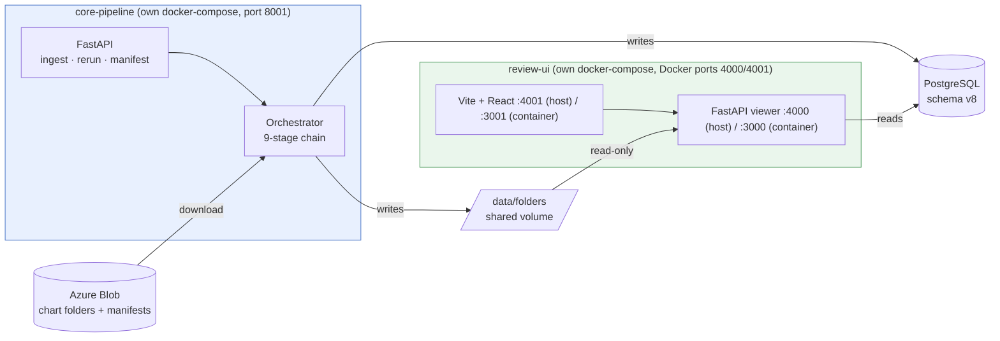
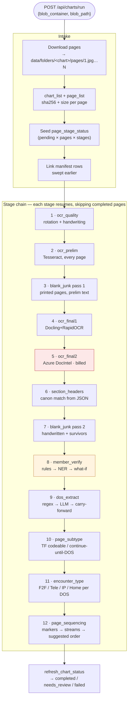
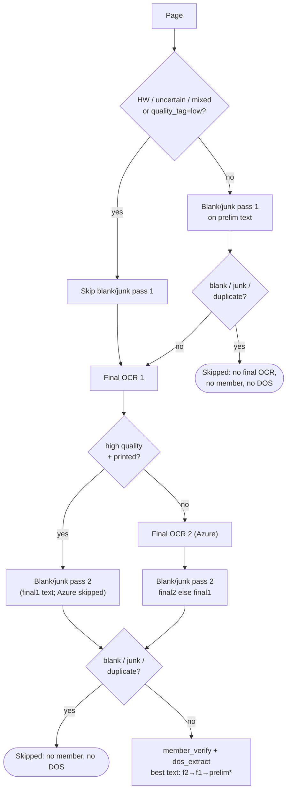
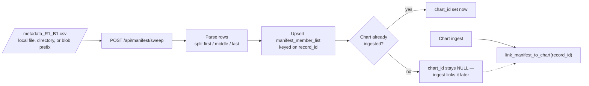
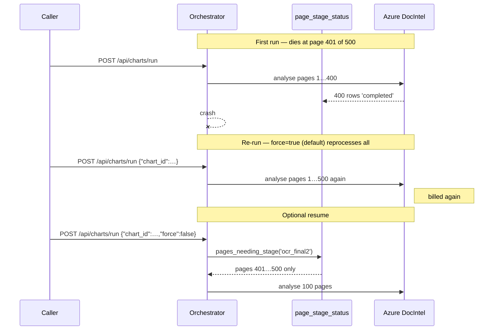
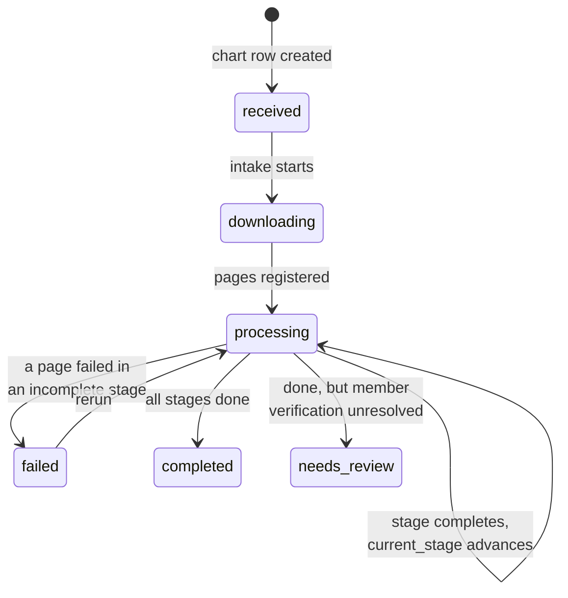

# Flow — what happens when

What moves through the system, in order, and what each step leaves behind.
For *why* each step decides what it decides, see [LOGIC.md](LOGIC.md).
For the HTTP surface, see [API.md](API.md).

---

## 1. The two deployments



The two services **never call each other**. They share the database and the
`data/folders` volume — core-pipeline writes it, review-ui mounts it read-only.
Either can be redeployed without the other.

---

## 2. End-to-end chart flow



Stages 5 and 7 are highlighted: **stage 5 costs money per page** (which is why
resume matters), and **stage 7 produces the accept/reject decision**.

---

## 3. What each stage reads and writes

| # | Stage | Runs on | Reads | Writes to Postgres | Writes to disk |
|---|-------|---------|-------|--------------------|----------------|
| 1 | `ocr_quality` | every page | page image | `ocr_quality_results` | `imaging/<chart>_rotation.csv`, `_hw_printed.csv`, `_quality.csv`, and `corrected-pages/<n>.jpg` when `ROTATION_CORRECTION_ENABLED` |
| 2 | `ocr_prelim` | every page | corrected page if one exists, else page image | `ocr_results` (`tesseract`) | `ocr/<chart>_prelim.txt` |
| 3 | `blank_junk` pass 1 | printed + non-low-quality only | prelim text | `blank_junk_classification` (pass 1) | `imaging/<chart>_junk.csv` |
| 4 | `ocr_final1` | not blank/junk, + HW / low-quality | corrected page if one exists, else page image | `ocr_results` (`docling`) | `ocr/<chart>_final1.json` (incl. `section_header_candidates`) |
| 5 | `ocr_final2` | not blank/junk, + HW / low-quality; **skips high-quality printed** | corrected page if one exists, else page image | `ocr_results` (`azuredocintel`) | `ocr/<chart>_final2.json` (incl. candidates / `pagesMeta`) |
| 6 | `section_headers` | pages with Final1 or Final2 JSON | those JSON files | updates `ocr_results` JSON blobs | rewrites `section_headers` in `*_final1.json` / `*_final2.json` |
| 7 | `blank_junk` pass 2 | HW + low-quality + surviving printed | final2 text, else final1 | `blank_junk_classification` (pass 2), then `is_final` stamped | rewrites `_junk.csv` |
| 8 | `member_verify` | not blank/junk/duplicate | best text + `manifest_member_list` | `member_extraction_results`, `member_verification_summary` | `_member_extraction.csv`, `_member_verification.csv`, `_member_v1_compare.csv` |
| 9 | `dos_extract` | not blank/junk/duplicate | best text | `dos_extraction_results` | `imaging/<chart>_dos.csv` |
| 10 | `page_subtype` | every page | best text + DOS + blank/junk | `page_classification` (main = TF; blank/junk/dup = `non_codeable` + junk subtype) | `imaging/<chart>_codeable.csv` |
| 11 | `encounter_type` | not blank/junk/duplicate | best text + DOS | `encounter_type_results` | `imaging/<chart>_encounter.csv` |
| 12 | `page_sequencing` | all pages (junk flagged) | best text | `page_sequencing_results` | `imaging/<chart>_sequencing.csv` |

Every stage also writes one `pipeline_jobs` row and updates
`page_stage_status` per page.

**"Best text"** means final2 → final1 → prelim (restricted). Prelim is never used
for handwritten / uncertain / mixed / low-quality pages.

---

## 4. Skip rules — why a page drops out



\* prelim only for printed non-low-quality pages.

  style STOP1 fill:#f5f5f5,stroke:#999
  style STOP2 fill:#f5f5f5,stroke:#999
```

Each skip is recorded — `page_stage_status.status='skipped'` with a
`skip_reason` (`handwritten`, `blank_junk_pass1`, `blank_junk`,
`no_final2_text`). A skipped page counts as *done* for chart-status purposes,
so a chart of blank pages still reaches `completed`.

### Adaptive skip_ocr (`skip_ocr=true`, `force=false`)

When OCR artifacts already exist, the orchestrator:

1. Hydrates `ocr/` / `ocr_results` (same as plain skip_ocr).
2. **Force-refreshes** `ocr_quality` (rotation + HW + measured quality).
3. Compares each page’s gate signature
   `(hw_class, quality_tag, rotation_applied, orientation_bucket)` to the
   pre-run snapshot (`core-pipeline/stages/gate_delta.py`).
4. Sets OCR-related `page_stage_status` rows back to pending only when
   artifacts are missing or the gate path changed (so OCR engines may re-run
   for those pages).
5. **Force-re-runs every non-OCR stage** — blank/junk (both passes), section
   headers, member, DOS, codeable, encounter, sequencing — regardless of
   prior completion.

```bash
curl -X POST localhost:8001/api/charts/run -H 'Content-Type: application/json' \
  -d '{"chart_id": 123, "skip_ocr": true, "force": false}'
```

---

## 5. Manifest flow — runs independently



The manifest is a fact about a **client RecordId**, not about a chart row we
happen to hold. Sweeping does **not** create placeholder charts — v6 did, which
filled the review UI with empty charts for records never ingested.

Order does not matter: sweep before ingest or after, the link is made either
way. `run_id` / `batch_id` come from the `R#`/`B#` in the filename unless
overridden.

---

## 6. Resume — what a re-run actually does



- Default / omit `force` → **reprocess** everything (`force=true`).
- `{"force": false}` → **resume**: completed and skipped pages are left alone.
- `{"only": ["member_verify"]}` → run just that stage.

---

## 7. Chart status over time

`chart_list.status` is lifecycle; `current_stage` is position. Both are derived
after every stage from the page rows — never set by hand.



Accept/reject lives on `member_verification_summary`, not on `chart_list.status`
(``rejected`` is legacy and is no longer written).

**The rule:** `current_stage` is the earliest stage, in `pipeline_stage.seq`
order, where not every page is `completed` or `skipped`.

Because stage order lives in a table rather than in code, registering
page-subtype / encounter / sequencing later is an `INSERT` plus a stage module —
no migration, no change to this logic.

---

## 8. Timeline of one 500-page chart

```mermaid
gantt
  title Where the wall-clock goes (indicative, STAGE_WORKERS=4)
  dateFormat X
  axisFormat %s
  section Intake
  Download 500 images        :0, 60
  section OCR
  Tesseract prelim           :60, 180
  Rotation + handwriting     :240, 120
  section Triage
  Blank/junk pass 1          :360, 10
  section Final OCR
  RapidOCR (final1)          :370, 300
  Azure DocIntel (final2)    :670, 400
  section Triage
  Blank/junk pass 2          :1070, 10
  section Extraction
  Member verify              :1080, 40
  DOS extract                :1120, 60
```



Blank/junk pass 1 pays for itself: every page it rules out is a page the two
final OCR stages never touch, and stage 5 is the billed one.
