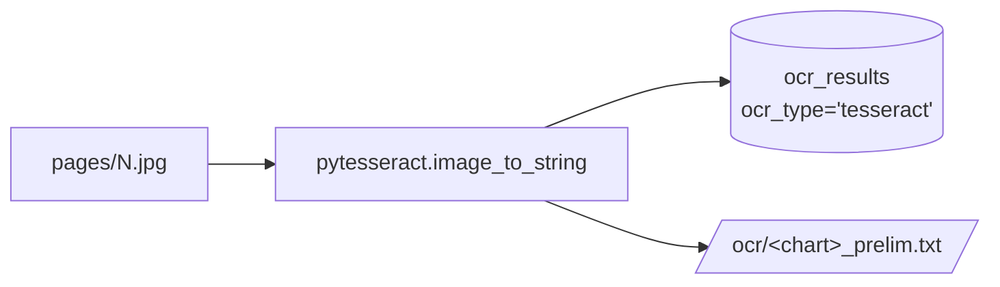
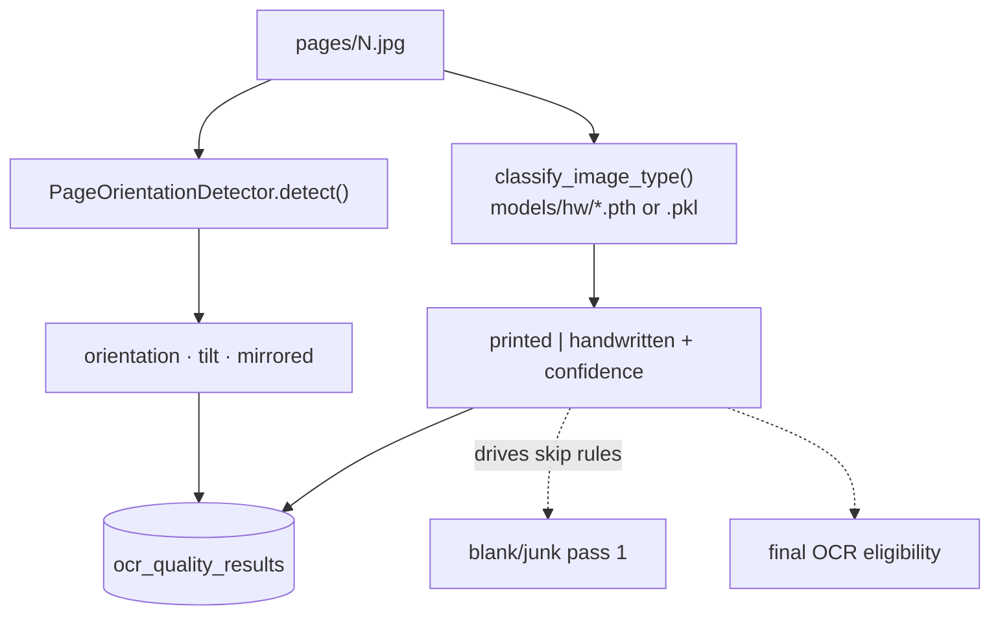
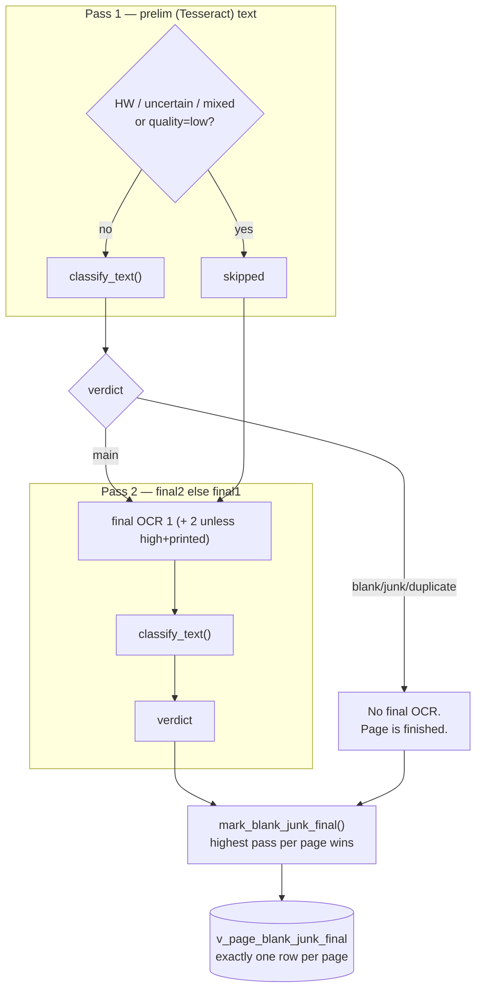
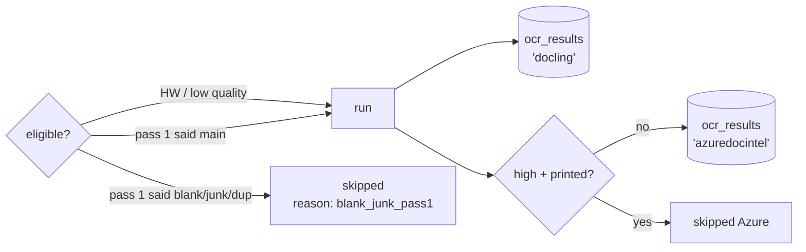
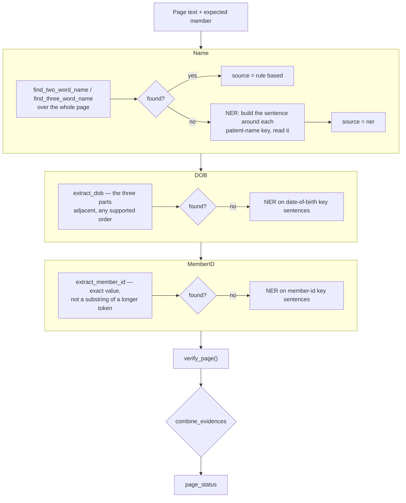
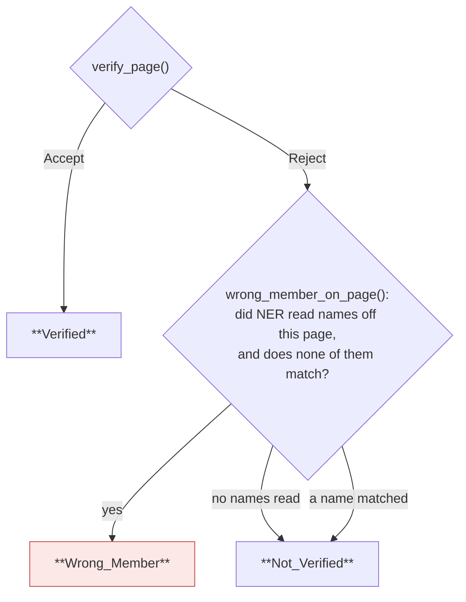
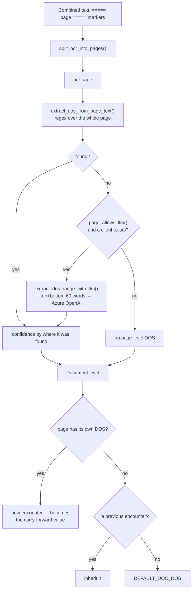

# Logic — how each decision is made, and what it writes

The reasoning inside each stage, and the exact rows it produces.
For the order things run in, see [FLOW.md](FLOW.md).

Every algorithm here is ported from the reference implementations under
the V1 prototypes. Where the port differs from them, it says so and why.

---

## Contents

1. [Preliminary OCR](#1-preliminary-ocr)
2. [Rotation and handwriting](#2-rotation-and-handwriting)
3. [Blank / junk / duplicate](#3-blank--junk--duplicate)
4. [Final OCR](#4-final-ocr)
5. [Member verification](#5-member-verification) ← the accept/reject decision
6. [Date of service](#6-date-of-service)
7. [Chart status](#7-chart-status)

---

## 1. Preliminary OCR

**Source:** V1 `ts_ocr.py` · **Stage:** `stages/ocr_prelim_tesseract.py`

> Reads `corrected-pages/<n>.jpg` when stage 1 wrote one, else `pages/<n>.jpg`.
> A 270°-rotated page OCRs at ~0.01 text similarity to the same page upright;
> corrected it is ~1.0. See [SCALING.md](SCALING.md) for worker pool shape.

Tesseract over every page. Deliberately cheap and deliberately first: its only
job is to give the blank/junk classifier something to read, so pages can be
ruled out before the expensive OCR runs.



**Writes**

| Target | Columns |
|---|---|
| `ocr_results` | `page_id`, `ocr_type='tesseract'`, `raw_text`, `char_count`, `text_sha256` |
| `page_stage_status` | `stage_name='ocr_prelim'`, `pass_no=1`, `status` |
| disk | `ocr/<chart>_prelim.txt`, blocks delimited `===== <page_name> =====` |

`char_count` and `text_sha256` exist so later stages can test for "is there any
text" and "has this changed" without pulling the `TEXT` column.

The combined `.txt` is rebuilt from the database on every run, so a resumed run
still produces a file covering all pages — not just the ones it touched.

---

## 2. Rotation and handwriting

**Source:** `stages/lib/imaging/rotation.py`, `hw_printed.py` · **Stage:** `stages/quality_rotation_hw.py`

Two independent measurements per page.



The handwriting label is the single most consequential output of this stage: it
decides whether a page is judged in blank/junk pass 1 or held back to pass 2.

Both the classifier and the detector are built **once per process**. The v6
implementation rebuilt them inside the per-page function, unpickling the model
for every page in the chart.

**Writes**

| Target | Columns |
|---|---|
| `ocr_quality_results` | `printed_or_handwritten`, `hw_method`, `hw_confidence`, `orientation_angle`, `tilt_angle`, `mirrored`, `rotation_applied`, plus the placeholder `quality_tag` / `quality_score` |
| disk | `imaging/<chart>_rotation.csv`, `imaging/<chart>_hw_printed.csv` |

Both CSVs are rebuilt from the database, so a resumed run cannot leave a
half-written file.

Failure is non-fatal by design: an unreadable image falls back to
`printed / 0.5 / "fallback"` rather than stopping the chart. The fallback is
recorded in `hw_method` so it is distinguishable from a real prediction.

### `quality_tag` / `quality_score` are measured

Stage 2 runs `quality_analyzer` (engineering submetrics, 0–10). The stored
`quality_score` is in [0, 1] (`score / 10`). Tags:

| `quality_score` | `quality_tag` |
|---|---|
| ≥ 0.70 | `high` |
| ≥ 0.40 | `medium` |
| else | `low` |

**Post-process (teammate `image_preprocessing` rule):** if the page is
`handwritten` and the tag would be `high`, store **`medium`** instead. The
numeric `quality_score` is unchanged — only the discrete label moves. That
keeps Final2's `high_quality_printed` skip honest (handwritten pages never
qualified anyway) while the UI does not show a handwritten page as “high”.

Submetrics and warnings live in `quality_detail` JSONB. Handwriting is separate
(`printed_or_handwritten` / `hw_method` / `hw_confidence`) — ConvNeXt when the
`.pth` is present, otherwise the RF pickle. In v7 `quality_tag` wrongly held the
classifier method; that value now lives in `hw_method`.

---

## 3. Blank / junk / duplicate

**Source:** `advantmed-imaging-ui/02-imaging-pipeline/junk-classification/` → `stages/lib/junk/` · **Stage:** `stages/blank_junk_classify.py`

### Why two passes

Tesseract reads handwriting badly, and low-quality scans are unreliable on
prelim text. So handwritten / uncertain / mixed **and** `quality_tag=low`
pages skip pass 1 and are judged in pass 2 on final OCR (final2 if present,
else final1).



### The classifier

`classify_text()` returns one code; the order it tries them in is the priority:

| Code | Label | Detector |
|---|---|---|
| 1 | Blank | `blank.py` — empty OCR, declared-blank text, or a near-empty image |
| 2 | Invoice | `invoice.py` |
| 3 | Cover Page | `cover.py` |
| 5 | Record Request/Transmittal | `record_request.py` |
| 6 | Instructions | `instructions.py` |
| 8 | Letter/Fax | `letter_fax.py` |
| 7 | Others | `others.py` — gibberish OCR, signature-only pages |
| 0 | Main | nothing matched — a real chart page |

Codes map to `blank_junk_flag` as: blank → `blank`, duplicate → `duplicate`,
any junk code → `junk` (+ `junk_subtype`), else `not_blank_junk`.

> `JUNK_CODES` contains `CODE_BLANK`, but `blank` is checked first and wins — a
> blank page is flagged `blank`, never `junk`. Pinned by
> `tests/test_blank_junk_and_dos.py::test_blank_wins_over_junk_even_though_it_is_in_junk_codes`.

`junk_subtype` is constrained by a `CHECK` to the six labels the review UI
renders. Anything else the classifier produces maps to `Others` rather than
becoming an unrenderable string.

### Duplicate detection

A page is a duplicate when its normalized OCR text is **> 95% similar**
(`difflib.SequenceMatcher`) to a neighbor **within ±2 pages** in chart order.

| Rule | Behaviour |
|---|---|
| Window | Compare only pages 2 before / 2 after (page order) |
| Threshold | Similarity **≥ 0.95** on whitespace-stripped lowercase text (UI: 100% → Yes, [95%, 100%) → May Be; May Be display confidence = `1 + (sim − 1) × 10`, e.g. 98%→80% / 99%→90% / 95%→50%) |
| Who wins | Higher normalized character count stays **main**; on a tie, the **earlier** page |
| Excluded | Blank pages and texts shorter than 50 normalized characters |
| Cross-pass | Prior-pass `main` pages are neighbors in pass 2 (so HW can match a printed original) |

`duplicate_of_page_id` records the kept original. A demoted prior-main page gets
an updated row on the current pass.

### One final verdict

Each pass writes its own row (`UNIQUE (page_id, pass_no)`). Then
`mark_blank_junk_final()` stamps the highest pass per page, and a partial unique
index (`WHERE is_final`) makes "two finals for one page" unrepresentable.
Downstream stages read `v_page_blank_junk_final` and never re-derive precedence.

**Writes**

| Target | Columns |
|---|---|
| `blank_junk_classification` | `pass_no`, `blank_junk_flag`, `junk_subtype`, `duplicate_of_page_id`, `ocr_source`, `confidence`, `reason`, `is_final` |
| disk | `imaging/<chart>_junk.csv` — **fully rewritten from the database** after each pass |

> v6 truncated the CSV in pass 1 and appended in pass 2, so re-running pass 2
> alone duplicated every row. The full rewrite makes the file converge.

---

## 4. Final OCR

**Stages:** `stages/ocr_final1_docling.py` (Docling layout + RapidOCR; falls back to RapidOCR-onnx only on a page timeout or a crash), `stages/ocr_final2_azure.py` (Azure Document Intelligence `prebuilt-read`)

Both run on pages not ruled out by pass 1, **plus every handwritten /
low-quality page**. Azure final2 additionally **skips high-quality printed**
pages (`skip_reason=high_quality_printed`) — final1 is enough for them.



`ocr_type='docling'` is the slot the review UI labels "Final (OSS)". When Docling
and the RapidOCR `.pth` models under `RAPID_MODELS_DIR` are ready, final1 uses
Docling's layout / TableFormer / reading-order pipeline (V1 `os_ocr.py`).
Otherwise it falls back to **RapidOCR-onnx only** (no Tesseract — prelim already
did that). Either way the on-disk artifact is `ocr/<chart>_final1.json`. See
[`docs/API.md` § Optional model weights](API.md#optional-model-weights-not-pip).

**final1 and final2 store JSON**, not bare text: `{pageNumber, fileName, content, …}`.
final1 also carries `markdown` and (when Docling ran) the full `document`
layout dump. Every consumer unwraps `content` — the review UI's Postgres and
Local adapters do it too.

Both engines/clients are built once per process. Stage 5 is the one billed per
page, which is why `pages_needing_stage` exists: a resumed run sends only the
pages that never completed.

When Azure DI is not configured the stage logs a warning and produces no text.
Member/DOS then use final1 (and prelim only for printed non-low-quality pages).

---

## 5. Member verification

**Source:** V1 `Member_Verification/` (~2,800 lines) → `core-pipeline/stages/lib/member/`
**Stage:** `stages/member_extract_verify.py`

This stage produces the accept/reject decision. It is a faithful port — function
names, call order and thresholds match the reference so a run is diffable
against it page for page.

### The central idea: expected-member driven

The pipeline does **not** extract a name from the page and then compare it. It
takes the manifest's first / middle / last / DOB / MemberID and **searches the
page for those specific values**. That is why `manifest_member_list` stores name
parts separately — `classify_two_word_name` matches first and last
independently, and a single joined string cannot drive it.

### Per-page algorithm



Rules run first over the whole page; **NER is reached only for a field the rules
missed**. A page the rules already matched costs no model time.

### The verification rule (`rules/base_rules.py`)

```
name not matched                        → Reject
name matched, initial only              → Accept iff DOB **and** MemberID found
name matched, both parts full           → Accept iff DOB **or** MemberID found
```

A name on its own is never enough. An initial-only match ("J Anderson") needs
both corroborators, because a single initial plus a surname is weak evidence.

| Name evidence | DOB | MemberID | Verdict |
|---|---|---|---|
| `Justin Anderson` | ✓ | — | **Accept** |
| `Justin Anderson` | — | ✓ | **Accept** |
| `Justin Anderson` | — | — | Reject |
| `J Anderson` | ✓ | ✓ | **Accept** |
| `J Anderson` | ✓ | — | Reject |
| `Marcus Anderson` | ✓ | ✓ | Reject — a *different* member |

That last row is the one that matters: a matching surname next to a different
given name is classified `ONE_FULL_WRONG`, not "partial match".

### The three page buckets



A page with nothing detected is **not** evidence of another member — it is
merely unverified. Only a page that positively names someone else counts.

### The document decision (`rules/what_if_rules.py`)

```
reject_threshold(total_pages) = max(1, min(5, ceil(total_pages × 0.10)))
document = Reject  if  wrong_member_pages ≥ reject_threshold
           Accept  otherwise
```

| Chart size | Rejects at |
|---|---|
| 3 pages | 1 wrong page |
| 12 pages | 2 |
| 40 pages | 4 |
| 60+ pages | 5 (the cap) |

The threshold is computed on the chart's **whole** page count, not on the subset
that reached this stage — blank/junk pages are excluded from checking but still
count toward the document's size. Pinned by
`test_threshold_uses_the_whole_document_not_the_subset`.

### ⚠️ The NER layer and what turning it off costs

`wrong_member_on_page()` decides from the names the NER layer read out of the
page's patient-name sentences. **With `MEMBER_NER_ENABLED=false`:**

- no page can ever be classified `wrong_member`;
- therefore `wrong_member_pages` is always 0;
- therefore **no document can ever be Rejected**;
- and a field the rules missed is never recovered, so recall is lower.

This is not a silent degradation. Every row carries `ner_enabled`, and the
summary's `decision_reason` is suffixed `|ner_disabled`. `GET /health` reports
it too.

#### Turning it on

The NER **code** is fully ported — `model.py`, `catalog.py`, `keys.py`,
`name.py`, `dob.py`, `member_id.py` and the model downloader. Two things are not
vendored, because neither belongs in a git repository:

1. **The runtime** — `gliner`, `torch`, `transformers` (~2.5 GB installed).
   Kept out of `requirements.txt` so the base image stays small.
2. **The checkpoints** — ~2 GB of weights.

```bash
# 1. Runtime
pip install -r requirements-ner.txt
#    Docker:  docker build --build-arg WITH_NER=true .

# 2. Checkpoints (into MEMBER_NER_MODELS_PATH)
python -m stages.lib.member.extractors.ner_based.model_downloader
python -m stages.lib.member.extractors.ner_based.model_downloader --check

# 3. Enable
export MEMBER_NER_ENABLED=true
curl localhost:8001/health | jq .member_ner     # expect ready: true
```

The downloader verifies each checkpoint twice: every file present and non-empty,
then an actual load plus one prediction — a snapshot can complete with all files
in place and still not load, which otherwise only shows up later as a run that
detects nothing.

`GET /health` and the member stage's first log line report which of the three
preconditions is unmet, because they need different fixes:

| `reason` | Fix |
|---|---|
| `gliner not installed (…)` | `pip install -r requirements-ner.txt` |
| `checkpoints missing: …` | run the downloader |
| `MEMBER_NER_ENABLED=false` | set the flag |

With the layer on, the reference's fail-loud contract is unchanged: a model that
will not load raises rather than quietly returning no hits.

### Writes

| Target | Columns |
|---|---|
| `member_extraction_results` (one per page) | `extracted_name/dob/member_id`, `detection_source_name/dob/member_id` (`rule_based`\|`ner`\|`''`), `ner_key_source_*` (which key sentence), `page_status` (`verified`\|`wrong_member`\|`not_verified`), `page_verified`, `confidence`, `provided_*`, `matched_member_list_id` |
| `member_verification_summary` (one per chart) | `final_status`, `document_decision` (`accept`\|`reject`), `name_mode`, `pages_checked`, `pages_matched`, `wrong_member_pages`, `reject_threshold`, `decision_reason` |
| disk | `_member_extraction.csv`, `_member_verification.csv`, `_member_v1_compare.csv` |

`_member_v1_compare.csv` is written in the **reference's own column order**
(`RecordId, Total_Page_Count, Page_No, Detection_Source_Name, …`) so a pipeline
run can be diffed directly against a V1 run.

`final_status` triages for the reviewer; `document_decision` is the business
outcome:

| Condition | `final_status` | `document_decision` |
|---|---|---|
| wrong-member pages ≥ threshold | `failed` | `reject` |
| ≥ 1 page verified | `verified` | `accept` |
| every page blank/junk/duplicate | `skipped` | *(null)* — chart still `completed` |
| no manifest row for the record | `needs_review` | *(null)* |
| manifest has no usable name | `needs_review` | `accept` |
| pages checked, none verified | `needs_review` | `accept` |

`confidence` is derived, not a model score: 0.5 for a verified page plus ~1/6
per field found, rules weighted above NER. The reference carried no numeric
confidence — it reported detection source per field, which is what the UI shows.

---

## 6. Date of service

**Source:** `advantmed-imaging-ui/02-imaging-pipeline/dos-extraction/` → `stages/lib/dos/` · **Stage:** `stages/dos_extract.py`

The stage calls the reference's own driver, `dos_logic.detect_dos_per_page()` —
the same entry point `extract_dos.py` uses. That driver owns the page splitting,
the escalation, the carry-forward and the ISO conversion.



Confidence comes from where the date was found:

| Situation | Confidence |
|---|---|
| Explicit admit+discharge range | `CONF_EDGE` (0.95) |
| Hit in the first/last 60 words | `CONF_EDGE` |
| Hit only mid-page | `CONF_FULL_PAGE` (0.70) |
| Several same-year dates | 0.60 |
| Hardcoded default | `CONF_DEFAULT` (0.80) |

### What v6 dropped, and this restores

v6 called only `extract_dos_from_page_text()` per page, bypassing the driver.
That lost three things:

1. **The LLM pass.** `extract_dos_range_with_llm` existed and was never called.
2. **The document-level carry-forward.** A page with no date of its own should
   inherit the previous encounter's.
3. **Real ISO conversion.** v6 wrote `doc_dos_from_iso` as a *copy* of the
   un-normalised `doc_dos_from`. Pinned by `test_iso_columns_are_actually_iso`.

### Multi-date pages

The reference emits comma-separated lists when a page names several dates,
while a single from/to column pair can hold only one. `dos_extraction_results`
therefore keeps the page-level and document-level pairs as **single-valued
columns** and puts every date the page carries in the **multi-valued `dates`
JSONB array** — one row per page, no child table.

**Writes**

| Target | Columns |
|---|---|
| `dos_extraction_results` | `date_of_service_from/to`, `..._doclevel` (single-valued), `dates` (JSONB array of `{seq, date_of_service_from, date_of_service_to, source_keyword, confidence}`), `extraction_method` (`rules`\|`llm`\|`rules+llm`), `confidence`. `date_count` is generated from `dates`. |
| disk | `imaging/<chart>_dos.csv` |

Without Azure OpenAI the stage runs regex-only and stamps
`extraction_method='rules'` — visible in the data, not silent. "Without" means
no endpoint, or no usable credential: either an API key or, on a VM with a
managed identity, an Entra token and no key. Which one was used is in the run
log (`auth=key` / `auth=entra`); the setting is
[`AZURE_OPENAI_AUTH`](API.md#azure-openai-key-or-no-key).

---

## 7. Chart status

**Module:** `core-pipeline/db/chart_status.py`

```
current_stage = earliest stage, in pipeline_stage.seq order,
                where not every page is completed|skipped
```

| Condition (checked in order) | `status` |
|---|---|
| No pages yet | `received` / `downloading` |
| A page `failed` in a stage that is not otherwise complete | `failed` |
| Some stage incomplete | `processing` (+ `current_stage`, `current_pass`) |
| All done, member `final_status='needs_review'` | `needs_review` |
| All done (including member `document_decision='reject'`) | `completed` |

Accept/reject is recorded on `member_verification_summary` only — `chart_list.status`
is never set to `rejected` (legacy value remapped by `schema/patch_output_path.sql`).

A page that `failed` in an otherwise-finished stage does **not** fail the chart —
every page reached a terminal state, so the stage is done and the failure stays
recorded on the page.

`skipped` counts as done, so a chart of entirely blank pages still reaches
`completed`.

### Why v7 split the column

v6 packed the stage name into `chart_list.status`, so:

- every new stage needed a `CHECK`-constraint migration, and
- **two passes of one stage were unrepresentable** — `blank_junk` appeared once
  in the ordering, before `ocr_final1`, so a chart sitting in pass 2 reported
  blank/junk already finished.

v8 uses lifecycle `status` + `current_stage` + `current_pass`, with order in the
`pipeline_stage` table.

---

## Where the logic lives

| Concern | File |
|---|---|
| Stage order, skip rules | `core-pipeline/orchestrator/runner.py`, `stages/_support.py` |
| Blank/junk detectors | `core-pipeline/stages/lib/junk/` |
| Member rules + NER | `core-pipeline/stages/lib/member/` |
| Member driver (ported `run.py`) | `core-pipeline/stages/lib/member/engine.py` |
| DOS regex + LLM + carry-forward | `core-pipeline/stages/lib/dos/dos_logic.py` |
| Status derivation | `core-pipeline/db/chart_status.py` |
| Persistence | `core-pipeline/db/__init__.py` |

Behaviour above is pinned by `tests/` (253 tests). A failure there means the port
has drifted from the reference — the fix is to restore it, not to update the
expectation.
