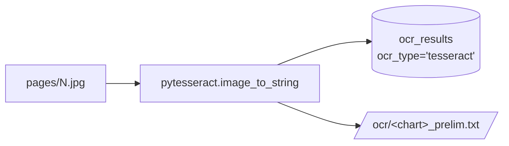
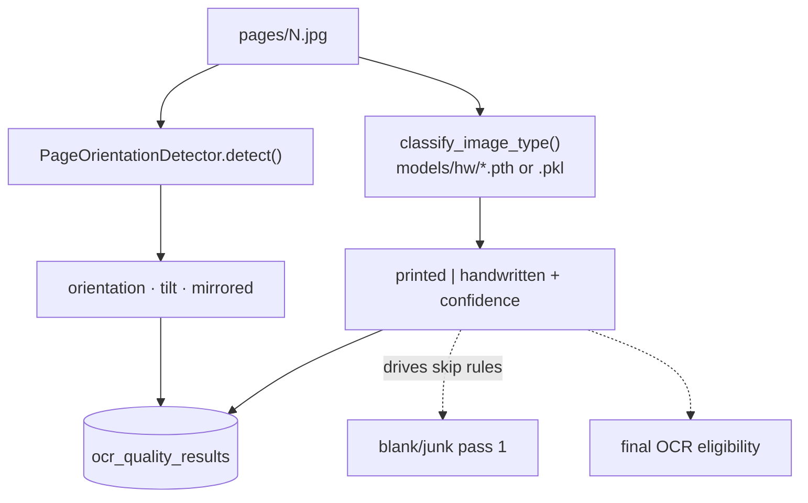
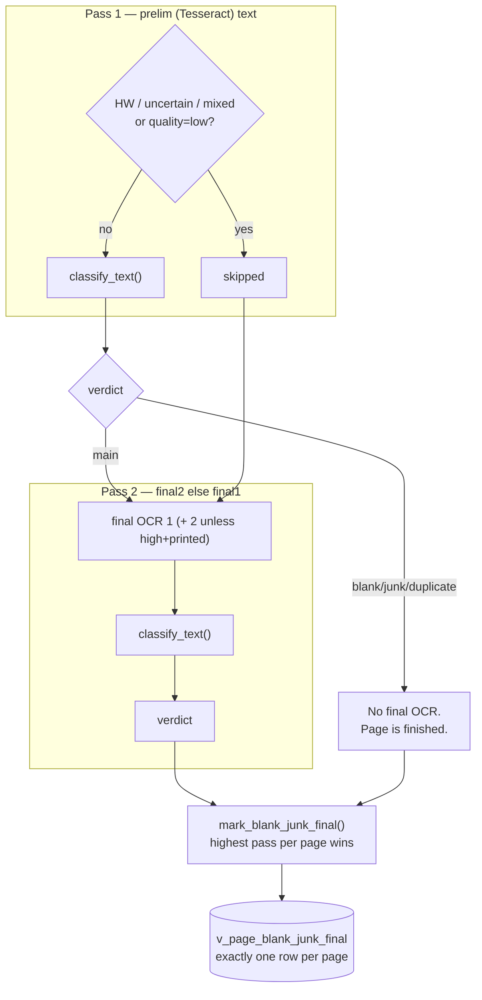
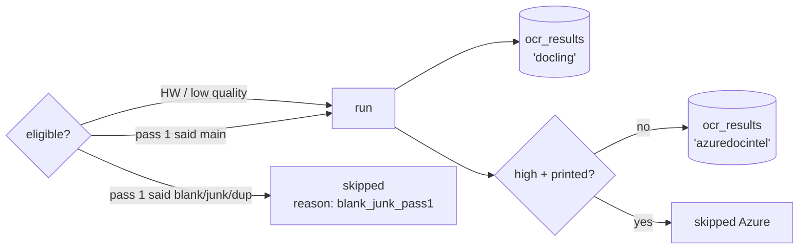
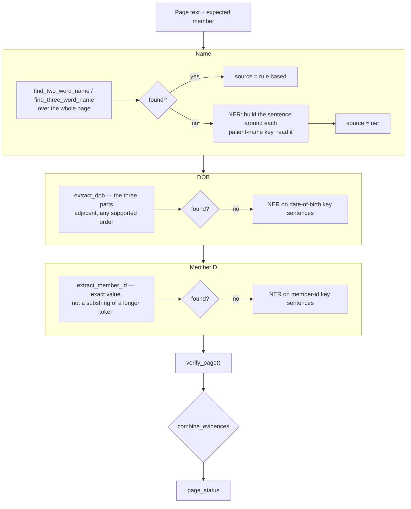
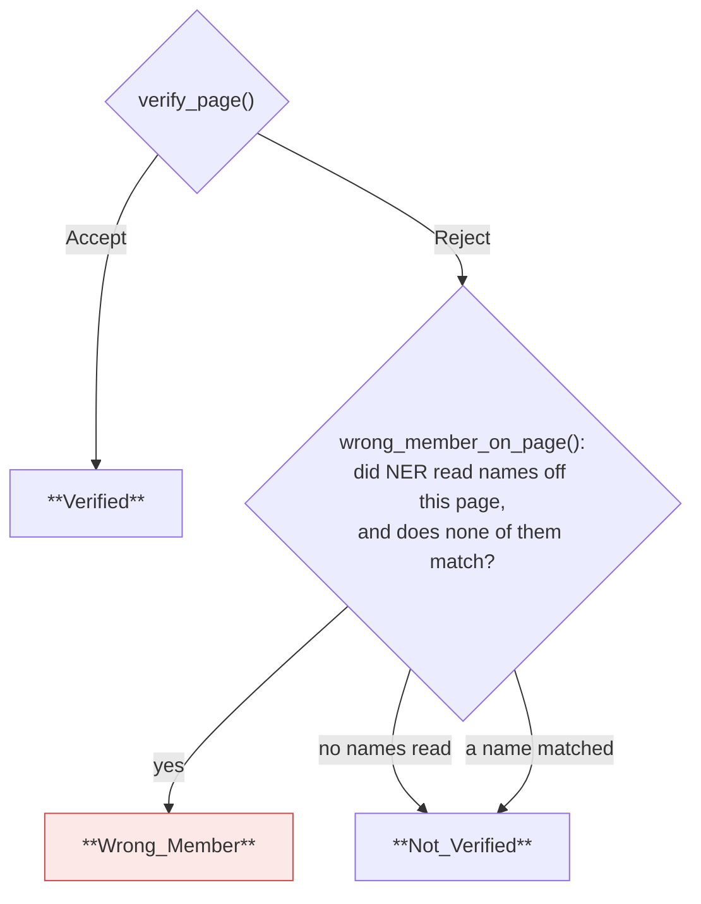
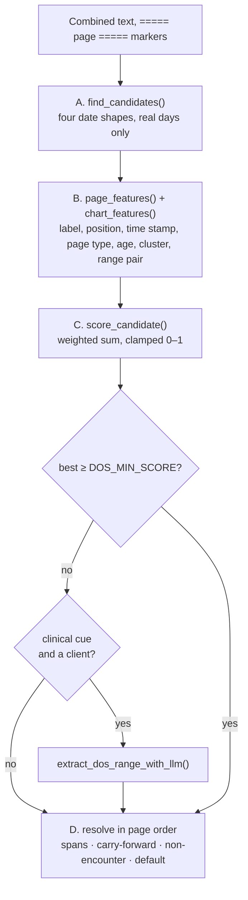

# Logic — how each decision is made, and what it writes

The reasoning inside each stage, and the exact rows it produces.
For the order things run in, see [FLOW.md](FLOW.md).

Every algorithm here is ported from the reference implementations under
the V1 prototypes. Where the port differs from them, it says so and why.

---

## Contents

1. [Preliminary OCR](#1-preliminary-ocr)
2. [Rotation and handwriting](#2-rotation-and-handwriting)
3. [Blank / junk / duplicate](#3-blank--junk--duplicate)
4. [Final OCR](#4-final-ocr)
5. [Member verification](#5-member-verification) ← the accept/reject decision
6. [Date of service](#6-date-of-service)
7. [Page type](#7-page-type)
8. [Encounter type](#8-encounter-type)
9. [Chart status](#9-chart-status)

---

## 1. Preliminary OCR

**Source:** V1 `ts_ocr.py` · **Stage:** `stages/lib/ocr/stage_prelim.py`

> Reads `corrected-pages/<n>.jpg` when stage 1 wrote one, else `pages/<n>.jpg`.
> A 270°-rotated page OCRs at ~0.01 text similarity to the same page upright;
> corrected it is ~1.0. See [SCALING.md](SCALING.md) for worker pool shape.

Tesseract over every page. Deliberately cheap and deliberately first: its only
job is to give the blank/junk classifier something to read, so pages can be
ruled out before the expensive OCR runs.


```mermaid
flowchart LR
  IMG["pages/N.jpg"] --> T["pytesseract.image_to_string"]
  T --> DB[("ocr_results<br/>ocr_type='tesseract'")]
  T --> TXT[/"ocr/&lt;chart&gt;_prelim.txt"/]
```

**Writes**

| Target | Columns |
|---|---|
| `ocr_results` | `page_id`, `ocr_type='tesseract'`, `raw_text`, `char_count`, `text_sha256` |
| `page_stage_status` | `stage_name='ocr_prelim'`, `pass_no=1`, `status` |
| disk | `ocr/<chart>_prelim.txt`, blocks delimited `===== <page_name> =====` |

`char_count` and `text_sha256` exist so later stages can test for "is there any
text" and "has this changed" without pulling the `TEXT` column.

The combined `.txt` is rebuilt from the database on every run, so a resumed run
still produces a file covering all pages — not just the ones it touched.

---

## 2. Rotation and handwriting

**Source:** `stages/lib/image_preprocess/rotation.py`, `hw_printed.py` · **Stage:** `stages/lib/image_preprocess/stage.py`

Two independent measurements per page.


```mermaid
flowchart TD
  IMG["pages/N.jpg"] --> R["PageOrientationDetector.detect()"]
  IMG --> H["classify_image_type()<br/>models/hw/*.pth or .pkl"]
  R --> RES["orientation · tilt · mirrored"]
  H --> HRES["printed | handwritten + confidence"]
  RES --> Q[("ocr_quality_results")]
  HRES --> Q
  HRES -.->|"drives skip rules"| BJ["blank/junk pass 1"]
  HRES -.-> F["final OCR eligibility"]
```

The handwriting label is the single most consequential output of this stage: it
decides whether a page is judged in blank/junk pass 1 or held back to pass 2.

Both the classifier and the detector are built **once per process**. The v6
implementation rebuilt them inside the per-page function, unpickling the model
for every page in the chart.

**Writes**

| Target | Columns |
|---|---|
| `ocr_quality_results` | `printed_or_handwritten`, `hw_method`, `hw_confidence`, `orientation_angle`, `tilt_angle`, `mirrored`, `rotation_applied`, plus the placeholder `quality_tag` / `quality_score` |
| disk | `imaging/<chart>_rotation.csv`, `imaging/<chart>_hw_printed.csv` |

Both CSVs are rebuilt from the database, so a resumed run cannot leave a
half-written file.

Failure is non-fatal by design: an unreadable image falls back to
`printed / 0.5 / "fallback"` rather than stopping the chart. The fallback is
recorded in `hw_method` so it is distinguishable from a real prediction.

### `quality_tag` / `quality_score` are measured

Stage 2 runs `quality_analyzer` (engineering submetrics, 0–10). The stored
`quality_score` is in [0, 1] (`score / 10`). Tags:

| `quality_score` | `quality_tag` |
|---|---|
| ≥ 0.70 | `high` |
| ≥ 0.40 | `medium` |
| else | `low` |

**Post-process (teammate `image_preprocessing` rule):** if the page is
`handwritten` and the tag would be `high`, store **`medium`** instead. The
numeric `quality_score` is unchanged — only the discrete label moves. That
keeps Final2's `high_quality_printed` skip honest (handwritten pages never
qualified anyway) while the UI does not show a handwritten page as “high”.

Submetrics and warnings live in `quality_detail` JSONB. Handwriting is separate
(`printed_or_handwritten` / `hw_method` / `hw_confidence`) — ConvNeXt when the
`.pth` is present, otherwise the RF pickle. In v7 `quality_tag` wrongly held the
classifier method; that value now lives in `hw_method`.

---

## 3. Blank / junk / duplicate

**Source:** `advantmed-imaging-ui/02-imaging-pipeline/junk-classification/` → `stages/lib/blank_junk/` · **Stage:** `stages/lib/blank_junk/stage.py`

### Why two passes

Tesseract reads handwriting badly, and low-quality scans are unreliable on
prelim text. So handwritten / uncertain / mixed **and** `quality_tag=low`
pages skip pass 1 and are judged in pass 2 on final OCR (final2 if present,
else final1).


```mermaid
flowchart TD
  subgraph P1["Pass 1 — prelim (Tesseract) text"]
    A{"HW / uncertain / mixed<br/>or quality=low?"} -- yes --> SKIP["skipped"]
    A -- no --> CLS1["classify_text()"]
  end

  CLS1 --> OUT1{"verdict"}
  OUT1 -- "blank/junk/duplicate" --> DROP["No final OCR.<br/>Page is finished."]
  OUT1 -- "main" --> F["final OCR 1 (+ 2 unless high+printed)"]
  SKIP --> F

  subgraph P2["Pass 2 — final2 else final1"]
    F --> CLS2["classify_text()"]
    CLS2 --> OUT2["verdict"]
  end

  OUT2 --> FINAL["mark_blank_junk_final()<br/>highest pass per page wins"]
  DROP --> FINAL
  FINAL --> V[("v_page_blank_junk_final<br/>exactly one row per page")]
```

### The classifier

`classify_text()` returns one code; the order it tries them in is the priority:

| Code | Label | Detector |
|---|---|---|
| 1 | Blank | `blank.py` — empty OCR, declared-blank text, or a near-empty image |
| 2 | Invoice | `invoice.py` |
| 3 | Cover Page | `cover.py` |
| 5 | Record Request/Transmittal | `record_request.py` |
| 6 | Instructions | `instructions.py` |
| 8 | Letter/Fax | `letter_fax.py` |
| 7 | Others | `others.py` — gibberish OCR, signature-only pages |
| 0 | Main | nothing matched — a real chart page |

Codes map to `blank_junk_flag` as: blank → `blank`, duplicate → `duplicate`,
any junk code → `junk` (+ `junk_subtype`), else `not_blank_junk`.

> `JUNK_CODES` contains `CODE_BLANK`, but `blank` is checked first and wins — a
> blank page is flagged `blank`, never `junk`. Pinned by
> `tests/test_blank_junk_and_dos.py::test_blank_wins_over_junk_even_though_it_is_in_junk_codes`.

`junk_subtype` is constrained by a `CHECK` to the six labels the review UI
renders. Anything else the classifier produces maps to `Others` rather than
becoming an unrenderable string.

### Duplicate detection

Duplicates are checked **after** the model's verdict, and only between pages the
model kept as Main — a blank or junk page is never compared. A Main page is a
duplicate when its normalized OCR text is **≥ 98% similar**
(`difflib.SequenceMatcher`) to a Main neighbor **within ±2 pages** in chart
order, or when its text is **wholly contained** in that neighbor's.

| Rule | Behaviour |
|---|---|
| Window | Compare only pages 2 before / 2 after (page order) |
| Threshold | Similarity **≥ 0.98** on whitespace-stripped lowercase text (UI: 100% → Yes, [98%, 100%) → May Be; May Be display confidence = `1 + (sim − 1) × 10`, e.g. 98%→80% / 99%→90%) |
| Containment | The shorter page's normalized text appears whole inside the longer one → duplicate, confidence 1.0 |
| Who wins | Higher normalized character count stays **main**; on a tie, the **earlier** page |
| Excluded | Blank / junk pages and texts shorter than 300 normalized characters (~50 words) |
| Cross-pass | Prior-pass `main` pages are neighbors in pass 2 (so HW can match a printed original) |

`duplicate_of_page_id` records the kept original. A demoted prior-main page gets
an updated row on the current pass.

### One final verdict

Each pass writes its own row (`UNIQUE (page_id, pass_no)`). Then
`mark_blank_junk_final()` stamps the highest pass per page, and a partial unique
index (`WHERE is_final`) makes "two finals for one page" unrepresentable.
Downstream stages read `v_page_blank_junk_final` and never re-derive precedence.

**Writes**

| Target | Columns |
|---|---|
| `blank_junk_classification` | `pass_no`, `blank_junk_flag`, `junk_subtype`, `duplicate_of_page_id`, `ocr_source`, `confidence`, `reason`, `is_final` |
| disk | `imaging/<chart>_junk.csv` — **fully rewritten from the database** after each pass |

> v6 truncated the CSV in pass 1 and appended in pass 2, so re-running pass 2
> alone duplicated every row. The full rewrite makes the file converge.

---

## 4. Final OCR

**Stages:** `stages/lib/ocr/stage_final1.py` (Docling layout + RapidOCR; falls back to RapidOCR-onnx only on a page timeout or a crash), `stages/lib/ocr/stage_final2.py` (Azure Document Intelligence `prebuilt-read`)

Both run on pages not ruled out by pass 1, **plus every handwritten /
low-quality page**. Azure final2 additionally **skips high-quality printed**
pages (`skip_reason=high_quality_printed`) — final1 is enough for them.


```mermaid
flowchart LR
  E{"eligible?"} -->|"HW / low quality"| YES["run"]
  E -->|"pass 1 said main"| YES
  E -->|"pass 1 said blank/junk/dup"| NO["skipped<br/>reason: blank_junk_pass1"]
  YES --> F1[("ocr_results<br/>'docling'")]
  YES --> HQ{"high + printed?"}
  HQ -->|no| F2[("ocr_results<br/>'azuredocintel'")]
  HQ -->|yes| SKIP2["skipped Azure"]
```

`ocr_type='docling'` is the slot the review UI labels "Final (OSS)". When Docling
and the RapidOCR `.pth` models under `RAPID_MODELS_DIR` are ready, final1 uses
Docling's layout / TableFormer / reading-order pipeline (V1 `os_ocr.py`).
Otherwise it falls back to **RapidOCR-onnx only** (no Tesseract — prelim already
did that). Either way the on-disk artifact is `ocr/<chart>_final1.json`. See
[`docs/API.md` § Downloading models](API.md#2-downloading-models).

**final1 and final2 store JSON**, not bare text: `{pageNumber, fileName, content, …}`.
final1 also carries `markdown` and (when Docling ran) the full `document`
layout dump. Every consumer unwraps `content` — the review UI's Postgres and
Local adapters do it too.

Both engines/clients are built once per process. Stage 5 is the one billed per
page, which is why `pages_needing_stage` exists: a resumed run sends only the
pages that never completed.

When Azure DI is not configured the stage logs a warning and produces no text.
Member/DOS then use final1 (and prelim only for printed non-low-quality pages).

---

## 5. Member verification

**Source:** V1 `Member_Verification/` (~2,800 lines) → `core-pipeline/stages/lib/member/`
**Stage:** `stages/lib/member/stage.py`

This stage produces the accept/reject decision. It is a faithful port — function
names, call order and thresholds match the reference so a run is diffable
against it page for page.

### The central idea: expected-member driven

The pipeline does **not** extract a name from the page and then compare it. It
takes the manifest's first / middle / last / DOB / MemberID and **searches the
page for those specific values**. That is why `manifest_member_list` stores name
parts separately — `classify_two_word_name` matches first and last
independently, and a single joined string cannot drive it.

### Per-page algorithm


```mermaid
flowchart TD
  START["Page text + expected member"] --> NAME

  subgraph NAME["Name"]
    N1["find_two_word_name / find_three_word_name<br/>over the whole page"]
    N1 --> N2{"found?"}
    N2 -- yes --> NR["source = rule based"]
    N2 -- no --> N3["NER: build the sentence around each<br/>patient-name key, read it"]
    N3 --> NN["source = ner"]
  end

  NAME --> DOB
  subgraph DOB["DOB"]
    D1["extract_dob — the three parts<br/>adjacent, any supported order"]
    D1 --> D2{"found?"} -- no --> D3["NER on date-of-birth key sentences"]
  end

  DOB --> MID
  subgraph MID["MemberID"]
    M1["extract_member_id — exact value,<br/>not a substring of a longer token"]
    M1 --> M2{"found?"} -- no --> M3["NER on member-id key sentences"]
  end

  MID --> VER["verify_page()"]
  VER --> COMB{"combine_evidences"}
  COMB --> PS["page_status"]
```

Rules run first over the whole page; **NER is reached only for a field the rules
missed**. A page the rules already matched costs no model time.

### The verification rule (`rules/base_rules.py`)

```
name not matched                        → Reject
name matched, initial only              → Accept iff DOB **and** MemberID found
name matched, both parts full           → Accept iff DOB **or** MemberID found
```

A name on its own is never enough. An initial-only match ("J Anderson") needs
both corroborators, because a single initial plus a surname is weak evidence.

| Name evidence | DOB | MemberID | Verdict |
|---|---|---|---|
| `Justin Anderson` | ✓ | — | **Accept** |
| `Justin Anderson` | — | ✓ | **Accept** |
| `Justin Anderson` | — | — | Reject |
| `J Anderson` | ✓ | ✓ | **Accept** |
| `J Anderson` | ✓ | — | Reject |
| `Marcus Anderson` | ✓ | ✓ | Reject — a *different* member |

That last row is the one that matters: a matching surname next to a different
given name is classified `ONE_FULL_WRONG`, not "partial match".

### The three page buckets


```mermaid
flowchart TD
  V{"verify_page()"} -- Accept --> VER["**Verified**"]
  V -- Reject --> W{"wrong_member_on_page():<br/>did NER read names off this page,<br/>and does none of them match?"}
  W -- yes --> WM["**Wrong_Member**"]
  W -- "no names read" --> NV["**Not_Verified**"]
  W -- "a name matched" --> NV

  style WM fill:#fde8e8,stroke:#c74a4a
```

A page with nothing detected is **not** evidence of another member — it is
merely unverified. Only a page that positively names someone else counts.

### The document decision (`rules/what_if_rules.py`)

```
reject_threshold(total_pages) = max(1, min(5, ceil(total_pages × 0.10)))
document = Reject  if  wrong_member_pages ≥ reject_threshold
           Accept  otherwise
```

| Chart size | Rejects at |
|---|---|
| 3 pages | 1 wrong page |
| 12 pages | 2 |
| 40 pages | 4 |
| 60+ pages | 5 (the cap) |

The threshold is computed on the chart's **whole** page count, not on the subset
that reached this stage — blank/junk pages are excluded from checking but still
count toward the document's size. Pinned by
`test_threshold_uses_the_whole_document_not_the_subset`.

### ⚠️ The NER layer and what turning it off costs

`wrong_member_on_page()` decides from the names the NER layer read out of the
page's patient-name sentences. **With `MEMBER_NER_ENABLED=false`:**

- no page can ever be classified `wrong_member`;
- therefore `wrong_member_pages` is always 0;
- therefore **no document can ever be Rejected**;
- and a field the rules missed is never recovered, so recall is lower.

This is not a silent degradation. Every row carries `ner_enabled`, and the
summary's `decision_reason` is suffixed `|ner_disabled`. `GET /health` reports
it too.

#### Turning it on

The NER **code** is fully ported — `model.py`, `catalog.py`, `keys.py`,
`name.py`, `dob.py`, `member_id.py` and the model downloader. Two things are not
vendored, because neither belongs in a git repository:

1. **The runtime** — `gliner`, `torch`, `transformers` (~2.5 GB installed), in
   `requirements-models.txt`.
2. **The checkpoints** — ~2 GB of weights.

```bash
# 1. Runtime
pip install -r requirements-models.txt

# 2. Checkpoints (into MEMBER_NER_MODELS_PATH)
python -m stages.lib.member.extractors.ner_based.model_downloader
python -m stages.lib.member.extractors.ner_based.model_downloader --check

# 3. Enable
export MEMBER_NER_ENABLED=true
curl localhost:8001/health | jq .member_ner     # expect ready: true
```

The downloader verifies each checkpoint twice: every file present and non-empty,
then an actual load plus one prediction — a snapshot can complete with all files
in place and still not load, which otherwise only shows up later as a run that
detects nothing.

`GET /health` and the member stage's first log line report which of the three
preconditions is unmet, because they need different fixes:

| `reason` | Fix |
|---|---|
| `gliner not installed (…)` | `pip install -r requirements-models.txt` |
| `checkpoints missing: …` | run the downloader |
| `MEMBER_NER_ENABLED=false` | set the flag |

With the layer on, the reference's fail-loud contract is unchanged: a model that
will not load raises rather than quietly returning no hits.

### Writes

| Target | Columns |
|---|---|
| `member_extraction_results` (one per page) | `extracted_name/dob/member_id`, `detection_source_name/dob/member_id` (`rule_based`\|`ner`\|`''`), `ner_key_source_*` (which key sentence), `page_status` (`verified`\|`wrong_member`\|`not_verified`), `page_verified`, `confidence`, `provided_*`, `matched_member_list_id` |
| `member_verification_summary` (one per chart) | `final_status`, `document_decision` (`accept`\|`reject`), `name_mode`, `pages_checked`, `pages_matched`, `wrong_member_pages`, `reject_threshold`, `decision_reason` |
| disk | `_member_extraction.csv`, `_member_verification.csv`, `_member_v1_compare.csv` |

`_member_v1_compare.csv` is written in the **reference's own column order**
(`RecordId, Total_Page_Count, Page_No, Detection_Source_Name, …`) so a pipeline
run can be diffed directly against a V1 run.

`final_status` triages for the reviewer; `document_decision` is the business
outcome:

| Condition | `final_status` | `document_decision` |
|---|---|---|
| wrong-member pages ≥ threshold | `failed` | `reject` |
| ≥ 1 page verified | `verified` | `accept` |
| every page blank/junk/duplicate | `skipped` | *(null)* — chart still `completed` |
| no manifest row for the record | `needs_review` | *(null)* |
| manifest has no usable name | `needs_review` | `accept` |
| pages checked, none verified | `needs_review` | `accept` |

`confidence` is derived, not a model score: 0.5 for a verified page plus ~1/6
per field found, rules weighted above NER. The reference carried no numeric
confidence — it reported detection source per field, which is what the UI shows.

---

## 6. Date of service

**Engine:** `stages/lib/dos/dos_logic.py` · **Stage:** `stages/lib/dos/stage.py` ·
**Profile:** `keyword-canon/dos_canon.json` (weights, labels, settings —
reloads on change)

Every date on every page becomes a candidate. Each candidate is scored. The
chart is then resolved page by page. Nothing is vetoed: a DOB label or an old
year is a large negative weight, so a losing date keeps a score that says why
it lost.


```mermaid
flowchart TD
  TXT["Combined text, ===== page ===== markers"] --> A["A. find_candidates()<br/>four date shapes, real days only"]
  A --> B["B. page_features() + chart_features()<br/>label, position, time stamp, page type, age, cluster, range pair"]
  B --> C["C. score_candidate()<br/>weighted sum, clamped 0–1"]
  C --> BEST{"best ≥ DOS_MIN_SCORE?"}
  BEST -- no --> LLM{"clinical cue<br/>and a client?"}
  LLM -- yes --> AOAI["extract_dos_range_with_llm()"]
  LLM -- no --> D
  AOAI --> D
  BEST -- yes --> D["D. resolve in page order<br/>spans · carry-forward · non-encounter · default"]
```

### A. Candidates

`MM/DD/YYYY` or `M/D/YY` (either `/` or `-`), `YYYY-MM-DD`, `Month D, YYYY`,
`D Month YYYY`. Two-digit years below 50 are 20xx, 50 and above 19xx. Dates
that are not real days (02/30) are dropped; everything else is kept.

### B. Features

| Feature | Meaning |
|---|---|
| `label_text` / `label_class` | Nearest label within 80 chars to the left: `encounter`, `admit`, `discharge`, `birth`, `doc_meta`, `future`, `procedure`, or `none`. A label never reaches past an earlier date. |
| `label_distance` | Characters between the label and the date |
| `position`, `edge_position` | Offset ÷ page length; in the first or last 60 words |
| `has_time` | A clock time beside the date (`03/20/2024 10:15 AM`, `…T10:00`) — the shape of a print/fax stamp |
| `page_type`, `has_clinical_cue` | `codeable_classify.page_type_of()` (per page, no DOS carry); `clinical_cues` |
| `year_delta` | Candidate year − chart received year (`chart_list.created_at`) |
| `cluster_size` | Other candidates in the chart within 30 days |
| `in_range_pair` | An admit and a discharge candidate within 200 chars |

### C. Score

```
score = base (0.5) + W[label_class] − 0.002 × label_distance
      + 0.10 if edge_position (not when has_time)
      − 0.30 if has_time
      + 0.10 if has_clinical_cue
      + 0.05 × min(cluster_size, 3)
      − 0.35 if year_delta < −DOS_MAX_AGE_YEARS
```

`W`: encounter +0.40, admit/discharge +0.30, none −0.10, procedure −0.30,
future −0.40, doc_meta −0.45, birth −0.50. Clamped to [0, 1]. The best
candidate at or above `DOS_MIN_SCORE` (0.55) is the page's date. If it is part
of an admit/discharge pair, the page gets the range. The chosen score is the
row's `confidence`.

### D. Resolve

| Page | Page level (extracted) | Document level | Final |
|---|---|---|---|
| Progress Note with a date | its date | opens a span with it (`span_start`) | its date |
| In a span, own date ≤ span override (0.75) | its date | the span's (`span`) | the progress note's date |
| In a span, no date of its own | blank | the span's (`span`) | the progress note's date |
| Own date above the span override, or no span | its date | its date — the new encounter | its date |
| Non-encounter page type (face sheet, demographics, problem/med/allergy list, vitals, immunization) | its date | the current encounter, never replaced (`non_encounter_page`) | its date |
| Nothing to inherit | blank | `DOS_DEFAULT_DATE`, confidence 0, `no_date_found`, `is_default` | blank |

The page-level columns stay the date found on that page. On a span page the
final date (`final_dos`) is the date from the progress note that opened the
span. Document level still carries that same encounter date, which later
stages read when the page itself has none.

Page types are exact `page_type` names from `codeable_canon.json`, listed in
the profile.

### Settings (profile)

| Key | Default | Meaning |
|---|---|---|
| `DOS_MAX_AGE_YEARS` | 6 | Age penalty applies to dates more than this many years before the received date. Replaces the fixed 2020 cutoff. |
| `DOS_MIN_SCORE` | 0.55 | Lowest score that counts as a page date |
| `DOS_DEFAULT_DATE` | 2022-02-02 | Delivered when nothing is found. review-ui and `encounter_classify` also know this value. |

`DOS_DEBUG=true` (env) writes every candidate, its features, its score and
whether it was chosen to `<chart>/debug/<chart>_dos_candidates.csv`. `debug/`
is not exported.

**Writes**

| Target | Columns |
|---|---|
| `dos_extraction_results` | `date_of_service_from/to`, `..._doclevel` (single-valued), `dates` (JSONB array of `{seq, date_of_service_from, date_of_service_to, source_keyword, confidence}`), `extraction_method` (`rules`\|`llm`\|`rules+llm`\|`kv`), `confidence`. `date_count` is generated from `dates`. |
| disk | `imaging/<chart>_dos.csv` |

Without Azure OpenAI the stage runs rules-only and stamps
`extraction_method='rules'` — visible in the data, not silent. "Without" means
no endpoint, or no usable credential: either an API key or, on a VM with a
managed identity, an Entra token and no key. Which one was used is in the run
log (`auth=key` / `auth=entra`); the setting is
[`AZURE_OPENAI_AUTH`](API.md#azure-openai-key-or-no-key).

---

## 7. Page type

**Engine:** `stages/lib/page_classify/codeable_classify.py` · **Stage:**
`stages/lib/page_classify/stage.py` · **Catalog:**
`keyword-canon/codeable_canon.json` (reloads on change) · **Family model:**
`models/page-family/family.joblib` (`PAGE_FAMILY_MODEL_DIR`)

Every main page (not blank / junk / duplicate) gets a family, then a subtype.
Blank, junk and duplicate pages are always Non Codeable. When the weights or
XGBoost are missing, the keywords choose the family.

### Picking the family and the subtype

1. **Model.** Top probability at least 0.50. Confidence is that probability.
2. **Keyword winner.** Used when the model did not commit and the winning family's raw keyword score is above 0.70. Confidence is that family's lead over the next keyword family, from 0 to 1. The raw score is only the gate; it is not the confidence.
3. **Top 3 overlap.** The model's top 3 and the keyword top 3. A family in both is tagged. The model's highest such family is kept. Confidence is that family's model probability.
4. **Others.** When none of the above hit. Confidence is 0.
5. **Subtype.** Inside the chosen family, the keyword type with the largest share of that family's scores. No subtype hit leaves the subtype equal to the family name. Others has no subtype.

After that, `postprocess.py` rewrites pages. Two rules so far, in order:

1. **Signature.** A page whose provider-signature row says a signature is present becomes Progress Note.
2. **Between.** A run of Patient Demographics with a Progress Note on both sides becomes Progress Note. The confidence is the lower of those two neighbours.

The 47 families, their tags and priorities, live in the canon's `families`
block. Display names are the model's labels (`Progress Note`, `Laboratory
Report`, `Discharge Summary`).

### The catalog

```json
{
  "id": "soap_note",
  "display": "SOAP Note (Subjective, Objective, Assessment, Plan)",
  "family": "progress_note",
  "continue": true,
  "match": {
    "primary":    ["soap note"],
    "supporting": ["assessment", "subjective", "objective"],
    "variants":   []
  }
}
```

| Field | Meaning |
|---|---|
| `id` | Stable key. `display` is what the reviewer sees (parentheticals hidden) |
| `family` | One of the `families` block. A family has a `tag`, a `priority` (lower wins ties) and `span`; the type takes its tag from the family and may not carry its own |
| `match.primary` | Decides the type and can open a span. Belongs to exactly one entry. Two or more words, or a word in `single_word_primary` |
| `match.variants` | Misspellings from the client's type list (`intial`, `requisation`, `dignosis`). Count as primary |
| `match.supporting` | Adds score, never decides the type |
| `continue` | The type runs over several pages: it opens a span for its family |

**The loader refuses a bad file** and names every offending entry: a primary
claimed by two entries, a one-word primary not on the allowlist, an entry with
no primary, an unknown family, a family without a valid tag, or a type that
carries its own tag. On a live reload the last good version
keeps serving; on first load the error is raised.

### Scoring

Text is lowercased with whitespace collapsed. Keywords match on word
boundaries, so `ems` does not hit "problems" and `sex` does not hit "sexual".

```
hit_weight  = phrase_weight[words] × band
phrase_weight: 1 word 1 · 2 words 4 · 3 words 6 · 4+ words 8
band:          top 15% of the page 2.0 · bottom 10% 0.5 · elsewhere 1.0
family_score = sum of the hits of every type in the family
               (a phrase two of its types share counts once per position)
```

A type name at the top of a page is the document's title; the same phrase in
the body is usually a cross-reference ("see discharge summary"), and a footer
usually repeats a form name.

### Picking the family from keywords

Used when the model abstains or its weights are missing.

1. A family is eligible when at least one of its hits is a primary or variant.
2. **Family:** the highest family score wins; on a tie, the lower priority
   (`progress_note` 10, `discharge_summary` 15). The family decides the tag.
3. **Subtype:** inside that family, each eligible type's share of the family's
   type scores is its probability; the most likely type wins (ties: the longer
   name). It is reported as `type_confidence`. No eligible type leaves the
   subtype equal to the family name.

**Dominance:** a family listed in `matching.dominant_families` wins outright
once its score reaches the threshold — Progress Note at 12, e.g. three
section headers in the body, or a header title plus one more hit — however
much the other families score.

**Fill between:** after spans, a page that matched nothing and sits between two
pages of a family in `matching.fill_between_families` (Progress Note) takes
that family, the previous page's type and the lower neighbour confidence
(`continue_applied=y`; `filled_between` in the evidence log).

**Confidence** = `(winning family − next family) / winning family`, at least
`confidence_floor` (0.30); 1.0 when no other family matched. Two Progress Note
types scoring the same is not uncertainty — either gives the same family and
tag.

**Demographics** is decided separately when patient-data fields cluster (two on
pages 1–2, four anywhere), unless a span family (progress note, discharge)
also matched.

### Spans

| Page | Result |
|---|---|
| Winner has `continue` | Opens (or replaces) a span for its family |
| Same date as the span, matched a type in the span's family | That type, the span's tag (`continue_applied=y`) |
| Same date, another family wins with score ≥ `span_break_score` (8) and the span's family has no primary/variant hit on the page | Its own type and tag; the span ends (`continue_applied=n`) |
| Same date, matched nothing, a weak other family, or the span's family is still a candidate | The opener's type and tag (`continue_applied=y`) |
| Different date, or no date | Span ends |

The span date is the page-level DOS, else the document-level one. The DOS
default (`DOS_DEFAULT_DATE`) counts as no date, so pages where date extraction
failed share a span with nobody.

### Evidence

`PAGE_CLASSIFY_DEBUG=true` writes
`<chart>/debug/<chart>_page_classify_evidence.csv`: per page, the chosen type
and family, per-family scores, every keyword hit with its role and band, page
position in the chart, the previous page's family and the OCR source. It is the
reviewer's "why" and the training set for a family-level classifier.

**Writes**

| Target | Columns |
|---|---|
| `page_classification` | `page_subtype` (display name), `classification_category`, `confidence` |
| disk | `imaging/<chart>_codeable.csv` |

---

## 8. Encounter type

**Engine:** `stages/lib/encounter/encounter_classify.py` · **Stage:**
`stages/lib/encounter/stage.py` · **Catalog:** `keyword-canon/encounter_canon.json`

One answer per visit — Outpatient (F2F), Outpatient (Tele), Inpatient or Home —
stamped on every page of the visit. **Evidence is ranked, not added up:** the
most authoritative evidence a visit has decides alone, so repeated "follow up"
can never outweigh one discharge summary.

### Visits

A visit is a run of **consecutive** pages sharing a date: the page's
document-level DOS, else its page-level DOS. The DOS default
(`DOS_DEFAULT_DATE`) is the absence of a date. A page without a usable date is
a visit of its own and stays unresolved (`no_date` / `default_date`). The same
date forty pages later is a second visit.

### Evidence

Each finding is recorded **once per visit**, however often its words appear.

| Tier | What | Decides? |
|---|---|---|
| 1 | A page type that exists in one setting only (`tier1_page_types`, keyed on the page type id). It must be matched on the page, not inherited from a span | Yes, alone |
| 2 | Text naming the setting: "telehealth", "hospital course", "home health visit", "place of service" | Only when tier 1 is empty |
| 3 | Hints found in several settings: "chief complaint", "follow up", "consultation", "h&p" | Never — breaks a tie inside the deciding tier |
| context | "radiology report", "mri report" … | Logged only |

Phrases match on word boundaries; a phrase ending in punctuation (`a/p:`,
`hpi:`) has no trailing boundary. **Negatives** ("discharged home",
"telephone message", "follow up with your primary care") remove the tier 2/3
finding they name, or every tier 2/3 finding of a setting. They never touch
tier 1.

### Decision

| Situation | Answer | `confidence` |
|---|---|---|
| Tier 1, one setting | that setting | 0.95 |
| Tier 1, two settings | more tier 3 hints, then setting priority (Home 10, Tele 20, F2F 30, Inpatient 40); `conflict=y` | 0.70 |
| Tier 1 empty, tier 2 one setting | that setting | 0.80 |
| Tier 2, two settings | as above; `conflict=y` | 0.60 |
| Nothing in tiers 1–2 | empty, `reason=no_setting_evidence` | 0 |

An unresolved visit never inherits from a neighbouring page. The buckets live
in the catalog; calibrate them against a labelled sample.

The **loader refuses** a catalog where a setting is unknown, a tier 1 id is not
a page type id, a phrase sits in two tiers or under two settings, a context
phrase also scores, or a negative cancels a phrase that does not exist.

### Writes

| Target | Columns |
|---|---|
| `encounter_type_results` | resolved pages only: `encounter_type`, `confidence`, `matched_keyword`. Rows for pages that are now unresolved are deleted |
| disk | `imaging/<chart>_encounter.csv`, every page: `encounter_type`, `encounter_label`, `confidence`, `matched_keyword` (page type for tier 1, phrase for tier 2), `continue_applied` (the page alone would answer differently or not at all), `decided_by` (`tier1`/`tier2`/`unresolved`), `reason`, `conflict` |

`ENCOUNTER_DEBUG=true` writes one evidence record per visit to
`<chart>/debug/<chart>_encounter_evidence.csv`: every finding with its tier,
source and page, cancelled findings, negatives that fired, context, the
deciding tier, the winner and any contender.

---

## 9. Chart status

**Module:** `core-pipeline/db/chart_status.py`

```
current_stage = earliest stage, in pipeline_stage.seq order,
                where not every page is completed|skipped
```

| Condition (checked in order) | `status` |
|---|---|
| No pages yet | `received` / `downloading` |
| A page `failed` in a stage that is not otherwise complete | `failed` |
| Some stage incomplete | `processing` (+ `current_stage`, `current_pass`) |
| All done, member `final_status='needs_review'` | `needs_review` |
| All done (including member `document_decision='reject'`) | `completed` |

Accept/reject is recorded on `member_verification_summary` only — `chart_list.status`
is never set to `rejected`.

A page that `failed` in an otherwise-finished stage does **not** fail the chart —
every page reached a terminal state, so the stage is done and the failure stays
recorded on the page.

`skipped` counts as done, so a chart of entirely blank pages still reaches
`completed`.

### Why v7 split the column

v6 packed the stage name into `chart_list.status`, so:

- every new stage needed a `CHECK`-constraint migration, and
- **two passes of one stage were unrepresentable** — `blank_junk` appeared once
  in the ordering, before `ocr_final1`, so a chart sitting in pass 2 reported
  blank/junk already finished.

v8 uses lifecycle `status` + `current_stage` + `current_pass`, with order in the
`pipeline_stage` table.

---

## Where the logic lives

| Concern | File |
|---|---|
| Stage order, skip rules | `core-pipeline/orchestrator/runner.py`, `stages/_support.py` |
| Blank/junk detectors | `core-pipeline/stages/lib/blank_junk/` |
| Member rules + NER | `core-pipeline/stages/lib/member/` |
| Member driver (ported `run.py`) | `core-pipeline/stages/lib/member/engine.py` |
| DOS regex + LLM + carry-forward | `core-pipeline/stages/lib/dos/dos_logic.py` |
| Status derivation | `core-pipeline/db/chart_status.py` |
| Persistence | `core-pipeline/db/__init__.py` |

Behaviour above is pinned by `tests/` (253 tests). A failure there means the port
has drifted from the reference — the fix is to restore it, not to update the
expectation.
