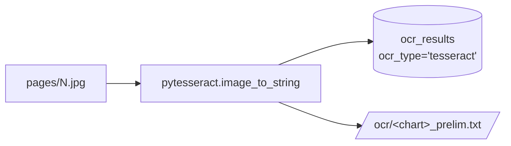
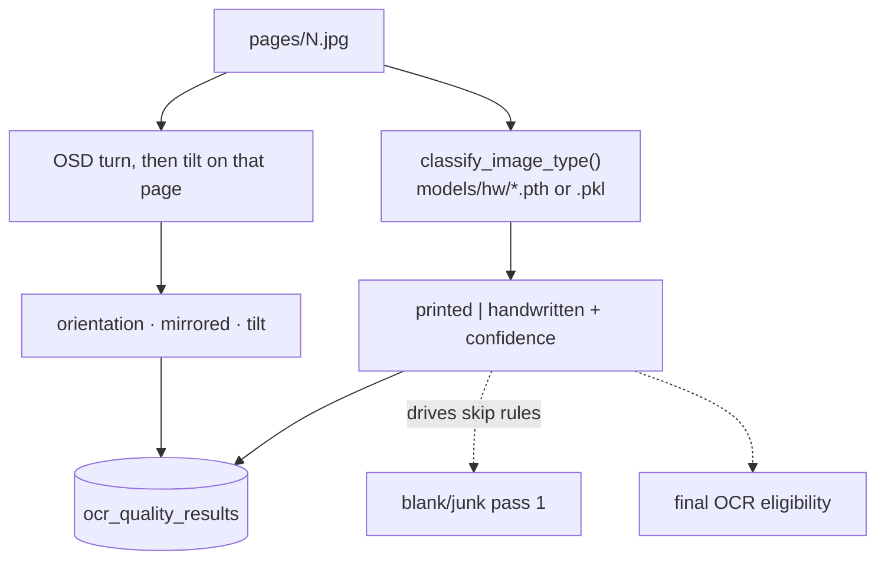
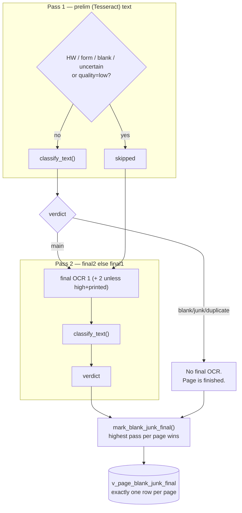
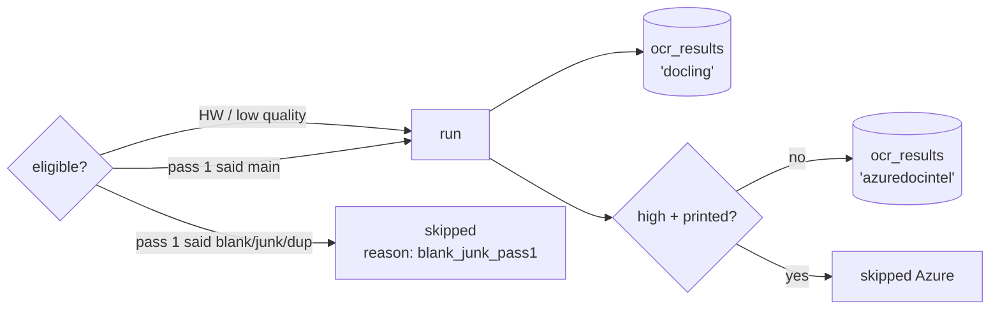
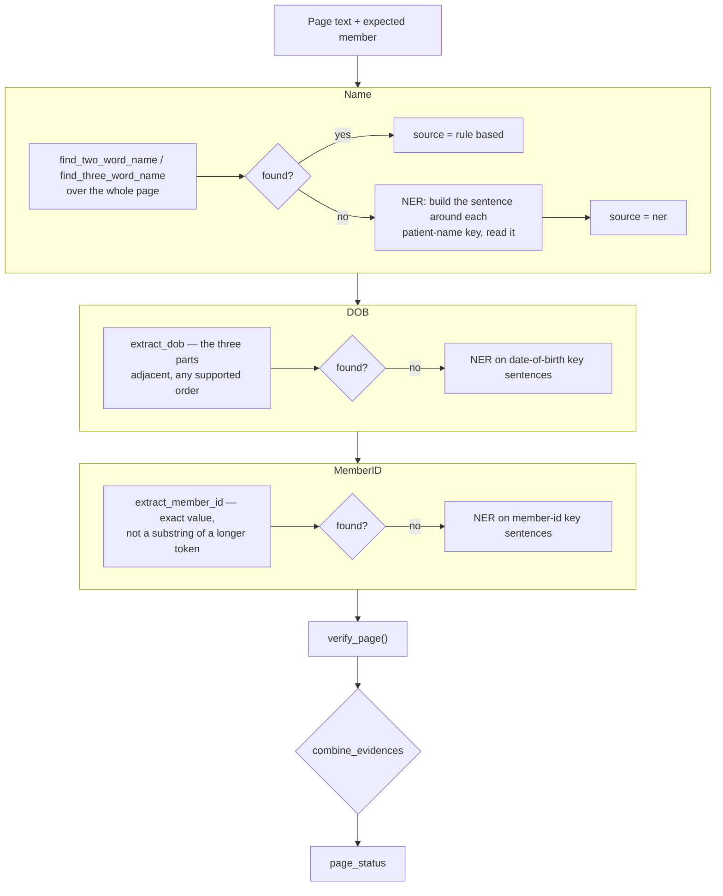
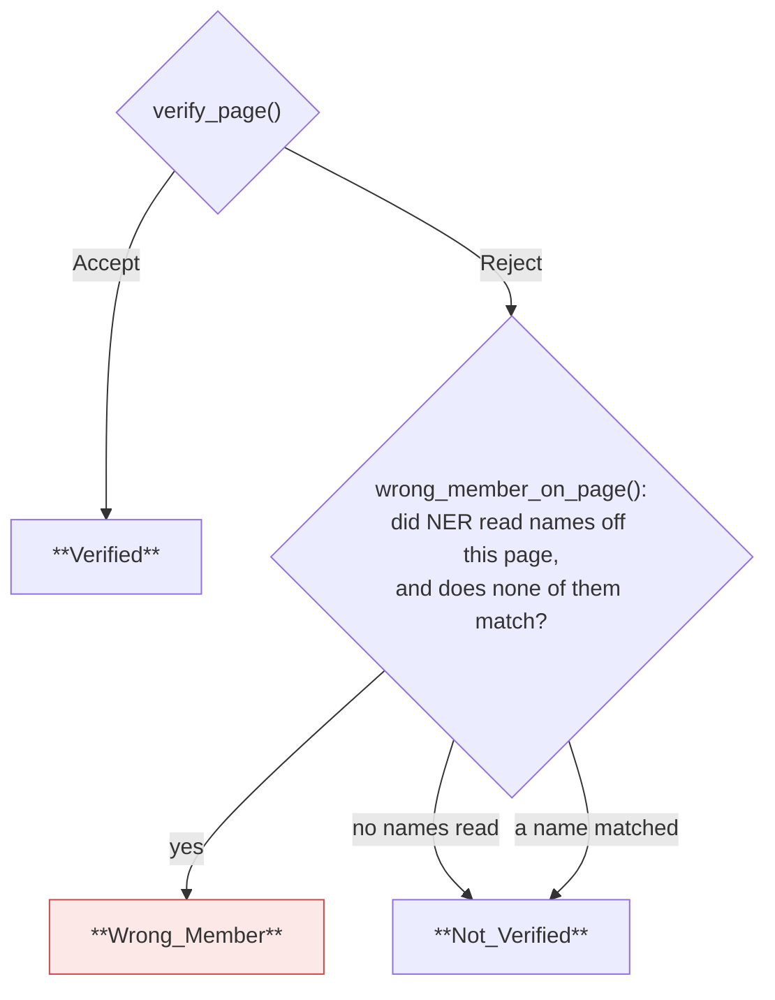
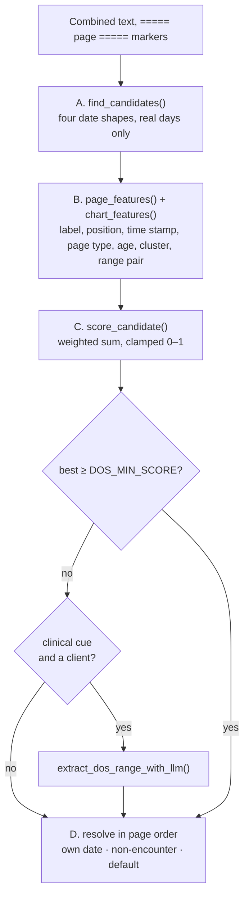

# Logic — how each decision is made, and what it writes

The reasoning inside each stage, and the exact rows it produces.
For the order things run in, see [FLOW.md](FLOW.md).

Every algorithm here is ported from the reference implementations under
the V1 prototypes. Where the port differs from them, it says so and why.

---

## Contents

1. [Preliminary OCR](#1-preliminary-ocr)
2. [Rotation and handwriting](#2-rotation-and-handwriting)
3. [Blank / junk / duplicate](#3-blank--junk--duplicate)
4. [Final OCR](#4-final-ocr)
5. [Member verification](#5-member-verification) ← the accept/reject decision
6. [Date of service](#6-date-of-service)
7. [Page type](#7-page-type)
   - [Document continuity](#7b-document-continuity) ← Final page type and Final DOS
8. [Encounter type](#8-encounter-type)
9. [Chart status](#9-chart-status)

---

## 1. Preliminary OCR

**Source:** V1 `ts_ocr.py` · **Stage:** `stages/lib/ocr/stage_prelim.py`

> Reads `corrected-pages/<n>.jpg` when stage 1 wrote one, else `pages/<n>.jpg`.
> A 270°-rotated page OCRs at ~0.01 text similarity to the same page upright;
> corrected it is ~1.0. See [SCALING.md](SCALING.md) for worker pool shape.

Tesseract over every page. Deliberately cheap and deliberately first: its only
job is to give the blank/junk classifier something to read, so pages can be
ruled out before the expensive OCR runs.


```mermaid
flowchart LR
  IMG["pages/N.jpg"] --> T["pytesseract.image_to_string"]
  T --> DB[("ocr_results<br/>ocr_type='tesseract'")]
  T --> TXT[/"ocr/&lt;chart&gt;_prelim.txt"/]
```

**Writes**

| Target | Columns |
|---|---|
| `ocr_results` | `page_id`, `ocr_type='tesseract'`, `raw_text`, `char_count`, `text_sha256` |
| `page_stage_status` | `stage_name='ocr_prelim'`, `pass_no=1`, `status` |
| disk | `ocr/<chart>_prelim.txt`, blocks delimited `===== <page_name> =====` |

`char_count` and `text_sha256` exist so later stages can test for "is there any
text" and "has this changed" without pulling the `TEXT` column.

The combined `.txt` is rebuilt from the database on every run, so a resumed run
still produces a file covering all pages — not just the ones it touched.

---

## 2. Rotation and handwriting

**Source:** `stages/lib/image_preprocess/rotation.py`, `hw_printed.py` · **Stage:** `stages/lib/image_preprocess/stage.py`

Two independent measurements per page.


```mermaid
flowchart TD
  IMG["pages/N.jpg"] --> R["OSD turn, then tilt on that page"]
  IMG --> H["classify_image_type()<br/>models/hw/*.pth or .pkl"]
  R --> RES["orientation · mirrored · tilt"]
  H --> HRES["printed | handwritten + confidence"]
  RES --> Q[("ocr_quality_results")]
  HRES --> Q
  HRES -.->|"drives skip rules"| BJ["blank/junk pass 1"]
  HRES -.-> F["final OCR eligibility"]
```

The handwriting label is the single most consequential output of this stage: it
decides whether a page is judged in blank/junk pass 1 or held back to pass 2.

Both the classifier and the detector are built **once per process**. The v6
implementation rebuilt them inside the per-page function, unpickling the model
for every page in the chart.

Coarse orientation starts from Tesseract OSD. No correction — turn, mirror
or tilt — is kept unless Tesseract reads the page at least as well with it as
without it. A read is scored in English dictionary words, and it *reads* when
it has at least 8 tokens of three or more letters and 40% of them are English.
(The junk module's gibberish check is not used: upside-down and mirrored reads
keep their vowels, and on four real charts it passed every one of them.)

Reads use Tesseract `--psm 4` on a copy of the page shrunk to 1600 px. The
default layout analysis turns top-to-bottom text back on its own, so a page
turned 90° read as well as the upright page and the two could not be told
apart. Under PSM 4 only the upright page reads.

1. **Turn.** OSD's turn stands when the page reads well at it (20+ English
   words) — one read, the common case. Otherwise all four quarter-turns are
   read and the one with the most English words is kept, if it reads. So a
   turn that comes out gibberish goes back to 0° when the page as it arrived
   reads better, and a page that is gibberish at 0° is turned when a
   quarter-turn reads. Ties keep OSD's turn, then 0°.
2. **Mirror**, decided with the turn. Only when no unflipped turn reads well
   are the four flipped pages read too; a flip is kept only when it reads more
   English than every unflipped turn. This also catches a page that is upside
   down *and* mirrored (turn 180° + flip).
3. Nothing reads at all — handwriting, a poor scan: OSD's turn stands,
   unmirrored. A page tagged `blank` is not read.
4. **Tilt** is measured last, on the page as it will be saved — turned and,
   if mirrored, flipped — because a flip reverses the direction of a lean.
   A tilt that would be applied is undone (`tilt_angle` 0) when the
   straightened page reads more than 10% fewer English words than the
   unstraightened one; a word or two either way is Tesseract noise.

`method` is `readability` when reading changed OSD's turn or added a flip.
The geometric detector's own coarse guess is not used.

Measured on 106 text pages from four charts, each turned 90/180/270,
mirrored, and flipped vertically: every case recovered, and no upright page
was moved.

Tilt is applied only up to `MAX_TILT_TO_APPLY` degrees either way (default
5). A larger reading is still stored in `tilt_angle` but the page is not
straightened by it, and on its own it does not produce a corrected copy.

**Writes**

| Target | Columns |
|---|---|
| `ocr_quality_results` | `printed_or_handwritten`, `hw_method`, `hw_confidence`, `document_type`, `handwritten_probability`, `is_visible`, `handwritten_area_pct`, `review_required`, `orientation_angle`, `tilt_angle`, `mirrored`, `rotation_applied`, plus the placeholder `quality_tag` / `quality_score` |
| disk | `imaging/<chart>_rotation.csv`, `imaging/<chart>_hw_printed.csv` |

Both CSVs are rebuilt from the database, so a resumed run cannot leave a
half-written file.

Failure is non-fatal by design: an unreadable image falls back to
`printed / 0.5 / "fallback"` rather than stopping the chart. The fallback is
recorded in `hw_method` so it is distinguishable from a real prediction.

### `quality_tag` / `quality_score` are measured

Stage 2 runs `quality_analyzer` (engineering submetrics, 0–10). The stored
`quality_score` is in [0, 1] (`score / 10`). Tags:

| `quality_score` | `quality_tag` |
|---|---|
| ≥ 0.70 | `high` |
| ≥ 0.40 | `medium` |
| else | `low` |

**Post-process (teammate `image_preprocessing` rule):** if the page is
`handwritten` and the tag would be `high`, store **`medium`** instead. The
numeric `quality_score` is unchanged — only the discrete label moves. That
keeps Final2's `high_quality_printed` skip honest (handwritten pages never
qualified anyway) while the UI does not show a handwritten page as “high”.

Submetrics and warnings live in `quality_detail` JSONB. Handwriting is separate
(`printed_or_handwritten` / `hw_method` / `hw_confidence`) — ConvNeXt when the
`.pth` is present, otherwise the RF pickle. In v7 `quality_tag` wrongly held the
classifier method; that value now lives in `hw_method`.

**Page-tag model.** A checkpoint saved with `task: "page_tags"` under the same
file name is loaded instead of the two-class model (`hw_method =
convnext_page_tags`). It gives a page type (Printed, Handwritten, Form, Visual,
Blank, Uncertain), visibility (Visible / Not visible) and the share of the page
that is handwriting. A type under the checkpoint's minimum confidence (0.50 if
absent) becomes Uncertain, except Blank. The ink upgrade does not run.
`printed_or_handwritten` keeps its four values:

| Page type | `printed_or_handwritten` |
|---|---|
| Printed, Visual | `printed` |
| Handwritten | `handwritten` |
| Form | `mixed` if ≥ 5% handwriting, else `printed` |
| Blank, Uncertain | `uncertain` |

They are stored in `ocr_quality_results.document_type`,
`handwritten_probability`, `is_visible` and `handwritten_area_pct`, and in the
hw CSV under the same names. `review_required` (quality CSV too) is true when
quality is `low` (not on a blank page), the type is uncertain, or the page is
not visible. With the two-class model the type is printed / handwritten /
uncertain / blank, and `is_visible` and `handwritten_area_pct` are NULL.

**Every page decision reads `document_type`** (`db.page_type()`; a row written
before the column existed falls back to `printed_or_handwritten`, `mixed` read
as form). Printed and visual pages are printed text: they run blank/junk
pass 1, and at `quality_tag=high` skip Final OCR 2. Handwritten, form, blank
and uncertain pages skip pass 1 and are judged on final OCR. Only a
handwritten page has High quality capped to Medium, is carried through
downstream stages before its pass-2 verdict, and keeps OSD's orientation
(form does too). `printed_or_handwritten` is still written but nothing decides
on it.

review-ui shows Type (Printed/HW), Handwritten % (area), Visibility, Quality,
Orientation Angle (Page), Tilt (Text) and Mirrored (Text) on the page details
and the summary table. P(handwritten) and `review_required` are in the
downloads only.

---

## 3. Blank / junk / duplicate

**Source:** `advantmed-imaging-ui/02-imaging-pipeline/junk-classification/` → `stages/lib/blank_junk/` · **Stage:** `stages/lib/blank_junk/stage.py`

### Why two passes

Tesseract reads handwriting badly, and low-quality scans are unreliable on
prelim text. So handwritten / form / blank / uncertain types **and** `quality_tag=low`
pages skip pass 1 and are judged in pass 2 on final OCR (final2 if present,
else final1).


```mermaid
flowchart TD
  subgraph P1["Pass 1 — prelim (Tesseract) text"]
    A{"HW / form / blank / uncertain<br/>or quality=low?"} -- yes --> SKIP["skipped"]
    A -- no --> CLS1["classify_text()"]
  end

  CLS1 --> OUT1{"verdict"}
  OUT1 -- "blank/junk/duplicate" --> DROP["No final OCR.<br/>Page is finished."]
  OUT1 -- "main" --> F["final OCR 1 (+ 2 unless high+printed)"]
  SKIP --> F

  subgraph P2["Pass 2 — final2 else final1"]
    F --> CLS2["classify_text()"]
    CLS2 --> OUT2["verdict"]
  end

  OUT2 --> FINAL["mark_blank_junk_final()<br/>highest pass per page wins"]
  DROP --> FINAL
  FINAL --> V[("v_page_blank_junk_final<br/>exactly one row per page")]
```

### The classifier

`classify_text()` returns one code; the order it tries them in is the priority:

| Code | Label | Detector |
|---|---|---|
| 1 | Blank | `blank.py` — empty OCR, declared-blank text, or a near-empty image |
| 2 | Invoice | `invoice.py` |
| 3 | Cover Page | `cover.py` |
| 5 | Record Request/Transmittal | `record_request.py` |
| 6 | Instructions | `instructions.py` |
| 8 | Letter/Fax | `letter_fax.py` |
| 7 | Others | `others.py` — gibberish OCR, signature-only pages |
| 0 | Main | nothing matched — a real chart page |

Codes map to `blank_junk_flag` as: blank → `blank`, duplicate → `duplicate`,
any junk code → `junk` (+ `junk_subtype`), else `not_blank_junk`.

> `JUNK_CODES` contains `CODE_BLANK`, but `blank` is checked first and wins — a
> blank page is flagged `blank`, never `junk`. Pinned by
> `tests/test_blank_junk_and_dos.py::test_blank_wins_over_junk_even_though_it_is_in_junk_codes`.

`junk_subtype` is constrained by a `CHECK` to the six labels the review UI
renders. Anything else the classifier produces maps to `Others` rather than
becoming an unrenderable string.

### Duplicate detection

Duplicates are checked **after** the model's verdict, and only between pages the
model kept as Main — a blank or junk page is never compared. A Main page is a
duplicate when its normalized OCR text is **≥ 98% similar**
(`difflib.SequenceMatcher`) to a Main neighbor **within ±2 pages** in chart
order, or when its text is **wholly contained** in that neighbor's.

| Rule | Behaviour |
|---|---|
| Window | Compare only pages 2 before / 2 after (page order) |
| Threshold | Similarity **≥ 0.98** on whitespace-stripped lowercase text (UI: 100% → Yes, [98%, 100%) → May Be; May Be display confidence = `1 + (sim − 1) × 10`, e.g. 98%→80% / 99%→90%) |
| Containment | The shorter page's normalized text appears whole inside the longer one → duplicate, confidence 1.0 |
| Who wins | Higher normalized character count stays **main**; on a tie, the **earlier** page |
| Excluded | Blank / junk pages and texts shorter than 300 normalized characters (~50 words) |
| Cross-pass | Prior-pass `main` pages are neighbors in pass 2 (so HW can match a printed original) |

`duplicate_of_page_id` records the kept original. A demoted prior-main page gets
an updated row on the current pass.

### One final verdict

Each pass writes its own row (`UNIQUE (page_id, pass_no)`). Then
`mark_blank_junk_final()` stamps the highest pass per page, and a partial unique
index (`WHERE is_final`) makes "two finals for one page" unrepresentable.
Downstream stages read `v_page_blank_junk_final` and never re-derive precedence.

**Writes**

| Target | Columns |
|---|---|
| `blank_junk_classification` | `pass_no`, `blank_junk_flag`, `junk_subtype`, `duplicate_of_page_id`, `ocr_source`, `confidence`, `reason`, `is_final` |
| disk | `imaging/<chart>_junk.csv` — **fully rewritten from the database** after each pass |

> v6 truncated the CSV in pass 1 and appended in pass 2, so re-running pass 2
> alone duplicated every row. The full rewrite makes the file converge.

---

## 4. Final OCR

**Stages:** `stages/lib/ocr/stage_final1.py` (Docling layout + RapidOCR; falls back to RapidOCR-onnx only on a page timeout or a crash), `stages/lib/ocr/stage_final2.py` (Azure Document Intelligence `prebuilt-read`)

Both run on pages not ruled out by pass 1, **plus every handwritten /
low-quality page**. Azure final2 additionally **skips high-quality printed**
pages (`skip_reason=high_quality_printed`) — final1 is enough for them.


```mermaid
flowchart LR
  E{"eligible?"} -->|"HW / low quality"| YES["run"]
  E -->|"pass 1 said main"| YES
  E -->|"pass 1 said blank/junk/dup"| NO["skipped<br/>reason: blank_junk_pass1"]
  YES --> F1[("ocr_results<br/>'docling'")]
  YES --> HQ{"high + printed?"}
  HQ -->|no| F2[("ocr_results<br/>'azuredocintel'")]
  HQ -->|yes| SKIP2["skipped Azure"]
```

`ocr_type='docling'` is the slot the review UI labels "Final (OSS)". When Docling
and the RapidOCR `.pth` models under `RAPID_MODELS_DIR` are ready, final1 uses
Docling's layout / TableFormer / reading-order pipeline (V1 `os_ocr.py`).
Otherwise it falls back to **RapidOCR-onnx only** (no Tesseract — prelim already
did that). Either way the on-disk artifact is `ocr/<chart>_final1.json`. See
[`docs/API.md` § Downloading models](API.md#2-downloading-models).

**final1 and final2 store JSON**, not bare text: `{pageNumber, fileName, content, …}`.
final1 also carries `markdown` and (when Docling ran) the full `document`
layout dump. Every consumer unwraps `content` — the review UI's Postgres and
Local adapters do it too.

Both engines/clients are built once per process. Stage 5 is the one billed per
page, which is why `pages_needing_stage` exists: a resumed run sends only the
pages that never completed.

When Azure DI is not configured the stage logs a warning and produces no text.
Member/DOS then use final1 (and prelim only for printed non-low-quality pages).

---

## 5. Member verification

**Source:** V1 `Member_Verification/` (~2,800 lines) → `core-pipeline/stages/lib/member/`
**Stage:** `stages/lib/member/stage.py`

This stage produces the accept/reject decision. It is a faithful port — function
names, call order and thresholds match the reference so a run is diffable
against it page for page.

### The central idea: expected-member driven

The pipeline does **not** extract a name from the page and then compare it. It
takes the manifest's first / middle / last / DOB / MemberID and **searches the
page for those specific values**. That is why `manifest_member_list` stores name
parts separately — `classify_two_word_name` matches first and last
independently, and a single joined string cannot drive it.

### Per-page algorithm


```mermaid
flowchart TD
  START["Page text + expected member"] --> NAME

  subgraph NAME["Name"]
    N1["find_two_word_name / find_three_word_name<br/>over the whole page"]
    N1 --> N2{"found?"}
    N2 -- yes --> NR["source = rule based"]
    N2 -- no --> N3["NER: build the sentence around each<br/>patient-name key, read it"]
    N3 --> NN["source = ner"]
  end

  NAME --> DOB
  subgraph DOB["DOB"]
    D1["extract_dob — the three parts<br/>adjacent, any supported order"]
    D1 --> D2{"found?"} -- no --> D3["NER on date-of-birth key sentences"]
  end

  DOB --> MID
  subgraph MID["MemberID"]
    M1["extract_member_id — exact value,<br/>not a substring of a longer token"]
    M1 --> M2{"found?"} -- no --> M3["NER on member-id key sentences"]
  end

  MID --> VER["verify_page()"]
  VER --> COMB{"combine_evidences"}
  COMB --> PS["page_status"]
```

Rules run first over the whole page; **NER is reached only for a field the rules
missed**. A page the rules already matched costs no model time.

### The verification rule (`rules/base_rules.py`)

```
name not matched                        → Reject
name matched, initial only              → Accept iff DOB **and** MemberID found
name matched, both parts full           → Accept iff DOB **or** MemberID found
```

A name on its own is never enough. An initial-only match ("J Anderson") needs
both corroborators, because a single initial plus a surname is weak evidence.

| Name evidence | DOB | MemberID | Verdict |
|---|---|---|---|
| `Justin Anderson` | ✓ | — | **Accept** |
| `Justin Anderson` | — | ✓ | **Accept** |
| `Justin Anderson` | — | — | Reject |
| `J Anderson` | ✓ | ✓ | **Accept** |
| `J Anderson` | ✓ | — | Reject |
| `Marcus Anderson` | ✓ | ✓ | Reject — a *different* member |

That last row is the one that matters: a matching surname next to a different
given name is classified `ONE_FULL_WRONG`, not "partial match".

### The three page buckets


```mermaid
flowchart TD
  V{"verify_page()"} -- Accept --> VER["**Verified**"]
  V -- Reject --> W{"wrong_member_on_page():<br/>did NER read names off this page,<br/>and does none of them match?"}
  W -- yes --> WM["**Wrong_Member**"]
  W -- "no names read" --> NV["**Not_Verified**"]
  W -- "a name matched" --> NV

  style WM fill:#fde8e8,stroke:#c74a4a
```

A page with nothing detected is **not** evidence of another member — it is
merely unverified. Only a page that positively names someone else counts.

### The document decision (`rules/what_if_rules.py`)

```
reject_threshold(total_pages) = max(1, min(5, ceil(total_pages × 0.10)))
document = Reject  if  wrong_member_pages ≥ reject_threshold
           Accept  otherwise
```

| Chart size | Rejects at |
|---|---|
| 3 pages | 1 wrong page |
| 12 pages | 2 |
| 40 pages | 4 |
| 60+ pages | 5 (the cap) |

The threshold is computed on the chart's **whole** page count, not on the subset
that reached this stage — blank/junk pages are excluded from checking but still
count toward the document's size. Pinned by
`test_threshold_uses_the_whole_document_not_the_subset`.

### ⚠️ The NER layer and what turning it off costs

`wrong_member_on_page()` decides from the names the NER layer read out of the
page's patient-name sentences. **With `MEMBER_NER_ENABLED=false`:**

- no page can ever be classified `wrong_member`;
- therefore `wrong_member_pages` is always 0;
- therefore **no document can ever be Rejected**;
- and a field the rules missed is never recovered, so recall is lower.

This is not a silent degradation. Every row carries `ner_enabled`, and the
summary's `decision_reason` is suffixed `|ner_disabled`. `GET /health` reports
it too.

#### Turning it on

The NER **code** is fully ported — `model.py`, `catalog.py`, `keys.py`,
`name.py`, `dob.py`, `member_id.py` and the model downloader. Two things are not
vendored, because neither belongs in a git repository:

1. **The runtime** — `gliner`, `torch`, `transformers` (~2.5 GB installed), in
   `requirements-models.txt`.
2. **The checkpoints** — ~2 GB of weights.

```bash
# 1. Runtime
pip install -r requirements-models.txt

# 2. Checkpoints (into MEMBER_NER_MODELS_PATH)
python -m stages.lib.member.extractors.ner_based.model_downloader
python -m stages.lib.member.extractors.ner_based.model_downloader --check

# 3. Enable
export MEMBER_NER_ENABLED=true
curl localhost:8001/health | jq .member_ner     # expect ready: true
```

The downloader verifies each checkpoint twice: every file present and non-empty,
then an actual load plus one prediction — a snapshot can complete with all files
in place and still not load, which otherwise only shows up later as a run that
detects nothing.

`GET /health` and the member stage's first log line report which of the three
preconditions is unmet, because they need different fixes:

| `reason` | Fix |
|---|---|
| `gliner not installed (…)` | `pip install -r requirements-models.txt` |
| `checkpoints missing: …` | run the downloader |
| `MEMBER_NER_ENABLED=false` | set the flag |

With the layer on, the reference's fail-loud contract is unchanged: a model that
will not load raises rather than quietly returning no hits.

### Writes

| Target | Columns |
|---|---|
| `member_extraction_results` (one per page) | `extracted_name/dob/member_id`, `detection_source_name/dob/member_id` (`rule_based`\|`ner`\|`''`), `ner_key_source_*` (which key sentence), `page_status` (`verified`\|`wrong_member`\|`not_verified`), `page_verified`, `confidence`, `provided_*`, `matched_member_list_id` |
| `member_verification_summary` (one per chart) | `final_status`, `document_decision` (`accept`\|`reject`), `name_mode`, `pages_checked`, `pages_matched`, `wrong_member_pages`, `reject_threshold`, `decision_reason` |
| disk | `_member_extraction.csv`, `_member_verification.csv`, `_member_v1_compare.csv` |

`_member_v1_compare.csv` is written in the **reference's own column order**
(`RecordId, Total_Page_Count, Page_No, Detection_Source_Name, …`) so a pipeline
run can be diffed directly against a V1 run.

`final_status` triages for the reviewer; `document_decision` is the business
outcome:

| Condition | `final_status` | `document_decision` |
|---|---|---|
| wrong-member pages ≥ threshold | `failed` | `reject` |
| ≥ 1 page verified | `verified` | `accept` |
| every page blank/junk/duplicate | `skipped` | *(null)* — chart still `completed` |
| no manifest row for the record | `needs_review` | *(null)* |
| manifest has no usable name | `needs_review` | `accept` |
| pages checked, none verified | `needs_review` | `accept` |

`confidence` is derived, not a model score: 0.5 for a verified page plus ~1/6
per field found, rules weighted above NER. The reference carried no numeric
confidence — it reported detection source per field, which is what the UI shows.

---

## 6. Date of service

**Engine:** `stages/lib/dos/dos_logic.py` · **Stage:** `stages/lib/dos/stage.py` ·
**Profile:** `keyword-canon/dos_canon.json` (weights, labels, settings —
reloads on change)

Every date on every page becomes a candidate. Each candidate is scored. The
chart is then resolved page by page. Nothing is vetoed: a DOB label or an old
year is a large negative weight, so a losing date keeps a score that says why
it lost.


```mermaid
flowchart TD
  TXT["Combined text, ===== page ===== markers"] --> A["A. find_candidates()<br/>four date shapes, real days only"]
  A --> B["B. page_features() + chart_features()<br/>label, position, time stamp, page type, age, cluster, range pair"]
  B --> C["C. score_candidate()<br/>weighted sum, clamped 0–1"]
  C --> BEST{"best ≥ DOS_MIN_SCORE?"}
  BEST -- no --> LLM{"clinical cue<br/>and a client?"}
  LLM -- yes --> AOAI["extract_dos_range_with_llm()"]
  LLM -- no --> D
  AOAI --> D
  BEST -- yes --> D["D. resolve in page order<br/>own date · non-encounter · default"]
```

### A. Candidates

`MM/DD/YYYY` or `M/D/YY` (either `/` or `-`), `YYYY-MM-DD`, `Month D, YYYY`,
`D Month YYYY`. Two-digit years below 50 are 20xx, 50 and above 19xx. Dates
that are not real days (02/30) are dropped; everything else is kept.

### B. Features

| Feature | Meaning |
|---|---|
| `label_text` / `label_class` | Nearest label within 80 chars to the left: `encounter`, `admit`, `discharge`, `birth`, `doc_meta`, `future`, `procedure`, or `none`. A label never reaches past an earlier date. |
| `label_distance` | Characters between the label and the date |
| `position`, `edge_position` | Offset ÷ page length; in the first or last 60 words |
| `has_time` | A clock time beside the date (`03/20/2024 10:15 AM`, `…T10:00`) — the shape of a print/fax stamp |
| `page_type`, `has_clinical_cue` | `page_classify.keywords.classify()` sub-type (per page); `clinical_cues` |
| `year_delta` | Candidate year − chart received year (`chart_list.created_at`) |
| `cluster_size` | Other candidates in the chart within 30 days |
| `in_range_pair` | An admit and a discharge candidate within 200 chars |

### C. Score

```
score = base (0.5) + W[label_class] − 0.002 × label_distance
      + 0.10 if edge_position (not when has_time)
      − 0.30 if has_time
      + 0.10 if has_clinical_cue
      + 0.05 × min(cluster_size, 3)
      − 0.35 if year_delta < −DOS_MAX_AGE_YEARS
```

`W`: encounter +0.40, admit/discharge +0.30, none −0.10, procedure −0.30,
future −0.40, doc_meta −0.45, birth −0.50. Clamped to [0, 1]. The best
candidate at or above `DOS_MIN_SCORE` (0.75) is the page's date — the backup when the key/value extraction chose no date (a key/value date always wins). If it is part
of an admit/discharge pair, the page gets the range. The chosen score is the
row's `confidence`.

### D. Resolve

| Page | Page level (extracted) | Document level | `final_dos` |
|---|---|---|---|
| A date of its own | its date | its date — the current encounter | its date |
| Non-encounter page type (face sheet, demographics, problem/med/allergy list, vitals, immunization) | its date | the current encounter, never replaced (`non_encounter_page`) | its date |
| No date of its own | blank | `DOS_DEFAULT_DATE`, confidence 0, `no_date_found`, `is_default` | blank |

Every page keeps the date found on it. There are no progress-note spans here:
carrying a document's date to its other pages is the continuity stage's Final
DOS (see **Document continuity**).

The profile's page types are sub-type names from `page_taxonomy.json` (a
generic sub-type has its page type's name), read with the keyword model
(`page_classify/keywords.py`) because DOS runs before the page-type stage.

### Settings (profile)

| Key | Default | Meaning |
|---|---|---|
| `DOS_MAX_AGE_YEARS` | 6 | Age penalty applies to dates more than this many years before the received date. Replaces the fixed 2020 cutoff. |
| `DOS_MIN_SCORE` | 0.75 | Lowest score for a text date, used only when no key/value date exists |
| `DOS_DEFAULT_DATE` | 2022-02-02 | Delivered when nothing is found. review-ui and `encounter_classify` also know this value. |

`DOS_DEBUG=true` (env) writes every candidate, its features, its score and
whether it was chosen to `<chart>/debug/<chart>_dos_candidates.csv`. `debug/`
is not exported.

**Writes**

| Target | Columns |
|---|---|
| `dos_extraction_results` | `date_of_service_from/to`, `..._doclevel` (single-valued), `dates` (JSONB array of `{seq, date_of_service_from, date_of_service_to, source_keyword, confidence}`), `extraction_method` (`rules`\|`llm`\|`rules+llm`\|`kv`), `confidence`. `date_count` is generated from `dates`. |
| disk | `imaging/<chart>_dos.csv` |

Without Azure OpenAI the stage runs rules-only and stamps
`extraction_method='rules'` — visible in the data, not silent. "Without" means
no endpoint, or no usable credential: either an API key or, on a VM with a
managed identity, an Entra token and no key. Which one was used is in the run
log (`auth=key` / `auth=entra`); the setting is
[`AZURE_OPENAI_AUTH`](API.md#azure-openai-key-or-no-key).

---

## 7. Page type

**Full design:** [PAGE_CLASSIFICATION.md](PAGE_CLASSIFICATION.md).

Per page (`page_subtype` stage, the **Extracted** answer): BERT
(`models/page-family/`) predicts a model type with a confidence; the keyword
model (`keyword-canon/page_keyword_canon.json`) predicts a sub-type with a
score, margin and title hit; the ladder in `page_arbitration.json` decides
the page type (agreement → bert_high → keyword_only_class → keyword_title →
bert_medium → keyword_body → bert_low), then the sub-type, then codability
from `page_taxonomy.json`. No model installed → keywords only, visible in
`/health`. Text: Final2 → Final1 → Tesseract.

Across pages (`imaging_final`, the **Final** answer): on the continuity
stage's documents, an untitled Progress-Note-looking page that continues
another document on a strong link takes that document's type, and a lab or
radiology page inside a Progress Note becomes Progress Note / Laboratory Data
(or Radiology Report). Weak evidence flags the page; it never changes it.

**Writes**

| Target | Columns |
|---|---|
| `page_classification` | `page_type`, `page_subtype`, `model_type`, `classification_category`, `decided_by`, `needs_review`, `bert_model_type`, `bert_confidence`, `keyword_page_subtype`, `keyword_score`, `keyword_margin`, `keyword_title_hit` |
| disk | `imaging/<chart>_codeable.csv` |

---

## 7b. Document continuity

**Runs:** after page type and DOS (`continuity`, seq 87), on every page that
is not blank, junk or duplicate. **Decides:** which document each page belongs
to. **Carries:** the document's first-page page type and DOS to every page in
it, as the Final value. The page's own page type and DOS stay as their stages
wrote them; review-ui shows them as Extracted beside Final.

Each page is judged against the previous one (blank/junk/duplicate pages are
passed over). Settings live in `keyword-canon/continuity_canon.json` and
reload on change.

| Tier | Signal | Effect |
|---|---|---|
| 1 | Printed `Page N of M` (or `pg`) in the header or footer band; the key/value extraction's page number when it chose one | Decides alone: `N+1 of M` continues; page 1, another total, or no step forward starts a new document |
| 2 | A line repeated in the header band (+5) or footer band (+2); headers / footers that look alike (+2 each); a shared accession (+6), order or visit number (+5), MRN (+1) | Adds to the score |
| 3 | A matched section header in the top 15% of this page (−6); a signature on the previous page (−3); "continued" (+6) | Adds to the score |

Score ≥ 5 continues, ≤ −2 starts a new document. In between is **unknown**:
the page starts its own document and is flagged for review, so nothing is
copied onto it on no evidence.

**Bands come from positions.** The header band is lines whose top is above 10%
of the page height, the footer band lines whose bottom is below 92%, read from
the Final2 JSON's line polygons (Final1 words grouped into lines when Final2 is
absent; first 4 / last 3 text lines when neither exists). Docling's markdown is
not in top-to-bottom order, so its first lines are not the page header.

**Progress notes.** A document whose first page is a Progress Note stays open
through pages the signals cannot decide (`decided_by = progress_note`). It
closes:

* after the page with a signature (a signature block in the text, or
  `signature_present` from the extraction) — that page is the note's last;
* before a page the signals or pagination call a new document;
* before the **next encounter**: a page whose own DOS differs from the note's
  *and* that carries a visit-opening section header (`encounter_headers`:
  Office Visit, Progress Note, History and Physical, Chief Complaint, …). This
  overrides printed pagination, because one EMR printout paginates several
  visits as one job (53688890: "page 1 of 17" across five office visits). A
  differing date alone does not close the note: continuation pages carry stray
  old dates (a 2017 problem-list date inside a 2025 note).

**Final values** (written by the `imaging_final` stage, last in the chain, into
`imaging_final` with every other field's Final value). Final page type follows
the continuation rules in [PAGE_CLASSIFICATION.md](PAGE_CLASSIFICATION.md) §6
(it is not copied from the first page).
Final DOS = its first page's DOS; when that page has none, the first page in
the document that has one, and the evidence says so. A continuation page with
no date of its own shows Extracted DOS NA and the Final DOS of the first page.

**Tuning.** Weights were set on 80 pagination-labelled page pairs from four
charts (55 continuations, 25 new documents), counting a wrong merge three
times worse than a wrong split — a merged page takes another document's page
type and DOS. Without pagination they merge 6 of 25 new documents (the
original weights merged 11) and split 1 of 55 continuations; 25 pairs are
left unknown for review. A repeated header line fires on 28% of new documents
(separate documents from one EMR share the patient banner), so it cannot
decide alone. Sentence-level signals are not used: "previous page ends without
punctuation" scored 28% on continuations against 29% on new documents.

**Replaces** three earlier mechanisms that could disagree: the MiniLM /
mid-sentence tagger (`stages/lib/continuation`), the DOS progress-note span
(`span_page_types`, `span_override_score`), and the page-type span and
fill-between (`continue`, `fill_between_families`).

**Writes**

| Target | Columns |
|---|---|
| `page_continuity_results` | `document_seq`, `seq` (page within the document), `position`, `relation`, `decided_by`, `confidence_level`, `score`, `review_required`, `evidence` |
| `imaging_final` (the `imaging_final` stage) | one row per page: the Final value of every reviewer field; page type, classification and DOS carried from the document, with `page_type_source` / `dos_source` = `document` or `page`. See [CONTINUITY.md](CONTINUITY.md) |
| `additional_page_details` (written by the key/value stage) | the printed page number and the page's `section_headers` JSON that continuity reads |
| disk | `imaging/<chart>_continuity.csv`: the same per page, plus the printed `page_no` / `page_total` used, the `section_headers`, the page's own `page_type`, `dos_from`, `dos_to`, and `layout_source` (final2 / final1 / text) |

---

## 8. Encounter type

**Engine:** `stages/lib/encounter/encounter_classify.py` · **Stage:**
`stages/lib/encounter/stage.py` · **Catalog:** `keyword-canon/encounter_canon.json`

One answer per visit — Outpatient (F2F), Outpatient (Tele), Inpatient or Home —
stamped on every page of the visit. **Evidence is ranked, not added up:** the
most authoritative evidence a visit has decides alone, so repeated "follow up"
can never outweigh one discharge summary.

### Visits

A visit is a run of **consecutive** pages sharing a date: the page's
document-level DOS, else its page-level DOS. The DOS default
(`DOS_DEFAULT_DATE`) is the absence of a date. A page without a usable date is
a visit of its own and stays unresolved (`no_date` / `default_date`). The same
date forty pages later is a second visit.

### Evidence

Each finding is recorded **once per visit**, however often its words appear.

| Tier | What | Decides? |
|---|---|---|
| 1 | A page type that exists in one setting only (`tier1_page_types`, keyed on the page type id). The page's own page type | Yes, alone |
| 2 | Text naming the setting: "telehealth", "hospital course", "home health visit", "place of service" | Only when tier 1 is empty |
| 3 | Hints found in several settings: "chief complaint", "follow up", "consultation", "h&p" | Never — breaks a tie inside the deciding tier |
| context | "radiology report", "mri report" … | Logged only |

Phrases match on word boundaries; a phrase ending in punctuation (`a/p:`,
`hpi:`) has no trailing boundary. **Negatives** ("discharged home",
"telephone message", "follow up with your primary care") remove the tier 2/3
finding they name, or every tier 2/3 finding of a setting. They never touch
tier 1.

### Decision

| Situation | Answer | `confidence` |
|---|---|---|
| Tier 1, one setting | that setting | 0.95 |
| Tier 1, two settings | more tier 3 hints, then setting priority (Home 10, Tele 20, F2F 30, Inpatient 40); `conflict=y` | 0.70 |
| Tier 1 empty, tier 2 one setting | that setting | 0.80 |
| Tier 2, two settings | as above; `conflict=y` | 0.60 |
| Nothing in tiers 1–2 | empty, `reason=no_setting_evidence` | 0 |

An unresolved visit never inherits from a neighbouring page. The buckets live
in the catalog; calibrate them against a labelled sample.

The **loader refuses** a catalog where a setting is unknown, a tier 1 id is not
a page type id, a phrase sits in two tiers or under two settings, a context
phrase also scores, or a negative cancels a phrase that does not exist.

### Writes

| Target | Columns |
|---|---|
| `encounter_type_results` | resolved pages only: `encounter_type`, `confidence`, `matched_keyword`. Rows for pages that are now unresolved are deleted |
| disk | `imaging/<chart>_encounter.csv`, every page: `encounter_type`, `encounter_label`, `confidence`, `matched_keyword` (page type for tier 1, phrase for tier 2), `continue_applied` (the page alone would answer differently or not at all), `decided_by` (`tier1`/`tier2`/`unresolved`), `reason`, `conflict` |

`ENCOUNTER_DEBUG=true` writes one evidence record per visit to
`<chart>/debug/<chart>_encounter_evidence.csv`: every finding with its tier,
source and page, cancelled findings, negatives that fired, context, the
deciding tier, the winner and any contender.

---

## 9. Chart status

**Module:** `core-pipeline/db/chart_status.py`

```
current_stage = earliest stage, in pipeline_stage.seq order,
                where not every page is completed|skipped
```

| Condition (checked in order) | `status` |
|---|---|
| No pages yet | `received` / `downloading` |
| A page `failed` in a stage that is not otherwise complete | `failed` |
| Some stage incomplete | `processing` (+ `current_stage`, `current_pass`) |
| All done, member `final_status='needs_review'` | `needs_review` |
| All done (including member `document_decision='reject'`) | `completed` |

Accept/reject is recorded on `member_verification_summary` only — `chart_list.status`
is never set to `rejected`.

A page that `failed` in an otherwise-finished stage does **not** fail the chart —
every page reached a terminal state, so the stage is done and the failure stays
recorded on the page.

`skipped` counts as done, so a chart of entirely blank pages still reaches
`completed`.

### Why v7 split the column

v6 packed the stage name into `chart_list.status`, so:

- every new stage needed a `CHECK`-constraint migration, and
- **two passes of one stage were unrepresentable** — `blank_junk` appeared once
  in the ordering, before `ocr_final1`, so a chart sitting in pass 2 reported
  blank/junk already finished.

v8 uses lifecycle `status` + `current_stage` + `current_pass`, with order in the
`pipeline_stage` table.

---

## Where the logic lives

| Concern | File |
|---|---|
| Stage order, skip rules | `core-pipeline/orchestrator/runner.py`, `stages/_support.py` |
| Blank/junk detectors | `core-pipeline/stages/lib/blank_junk/` |
| Member rules + NER | `core-pipeline/stages/lib/member/` |
| Member driver (ported `run.py`) | `core-pipeline/stages/lib/member/engine.py` |
| DOS regex + LLM | `core-pipeline/stages/lib/dos/dos_logic.py` |
| Document continuity, Final page type + DOS | `core-pipeline/stages/lib/continuity/`, `keyword-canon/continuity_canon.json` |
| Status derivation | `core-pipeline/db/chart_status.py` |
| Persistence | `core-pipeline/db/__init__.py` |

Behaviour above is pinned by `tests/` (253 tests). A failure there means the port
has drifted from the reference — the fix is to restore it, not to update the
expectation.
