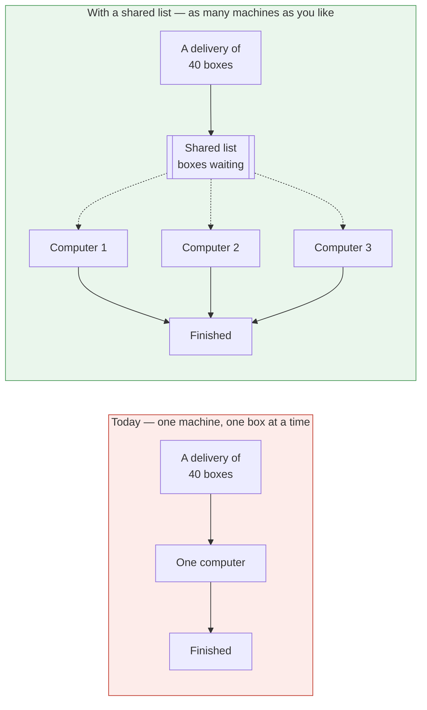
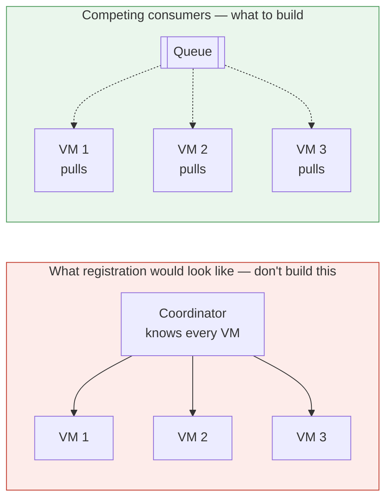
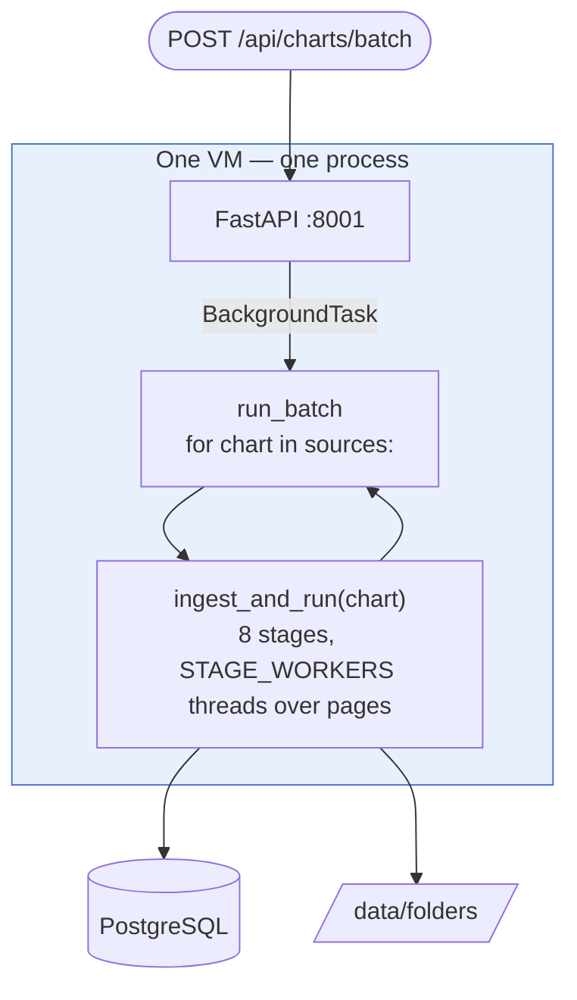
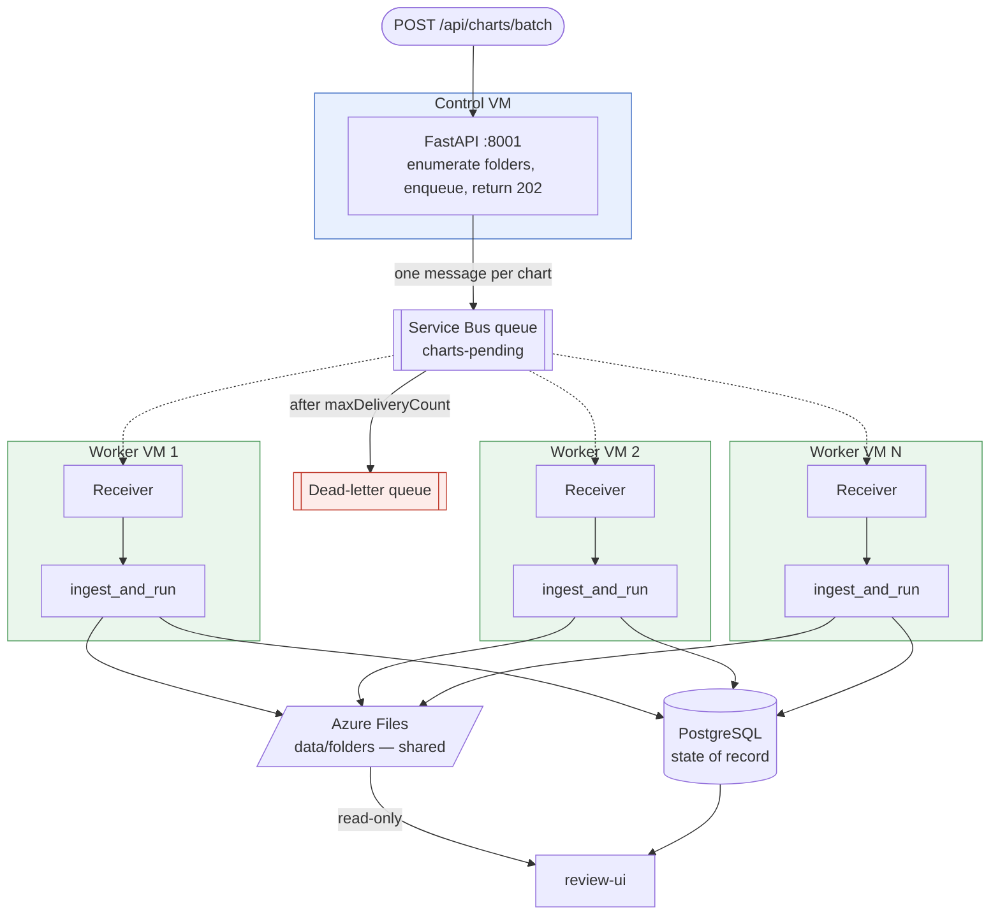
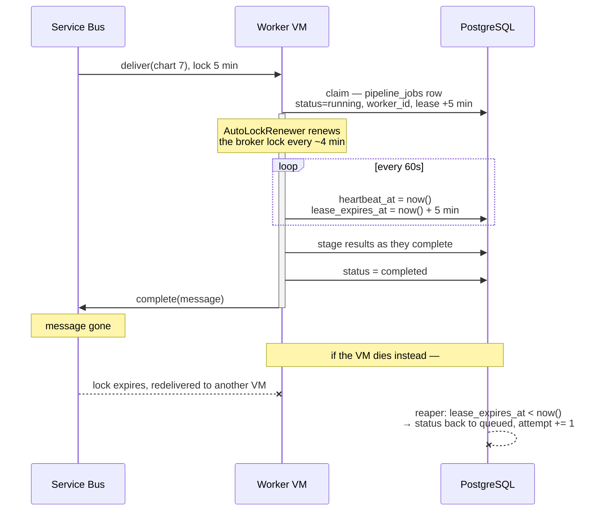
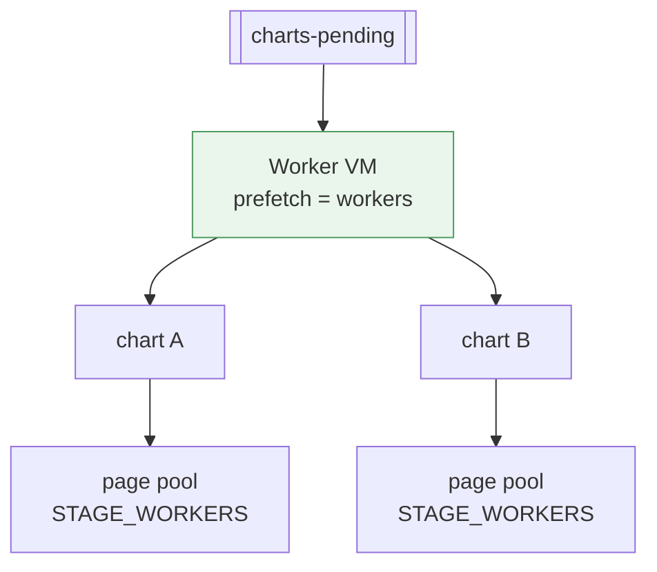
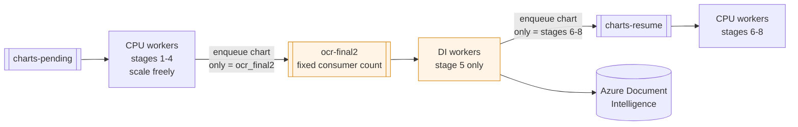
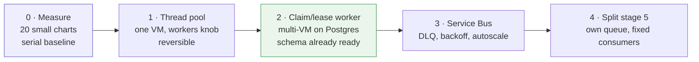

# Scaling across machines

How to make this run on more than one computer: what would change, what it buys,
what it costs, and in what order to do it.

**Status: design, not built.** Nothing described here exists in the code. It
extends the single-machine batch worker pool (``BATCH_WORKERS`` ×
``STAGE_WORKERS``) to multiple machines.

**This document has two halves.** [Part 1](#part-1--in-plain-language) explains the
whole proposal without assuming any technical background, and is meant to be read
on its own. [Part 2](#part-2--the-technical-design) is the implementation detail.

---

# Part 1 — in plain language

## What the system does today

Think of each patient chart as a box of scanned paper. The software is a
processing line: it straightens each page, reads the text on it, discards the
pages that carry nothing — blank sheets, fax cover pages, duplicates — checks that
the chart really belongs to the patient it is filed under, and notes the dates of
treatment.

Right now **one computer does all of this, one box at a time.** Given a delivery
of forty boxes it works through them in order: box one, then box two, and so on.

## What is slow about that

Two separate things, which is why there are two proposed changes.

**Small boxes waste the machine.** The computer works on four pages at once. A box
containing three pages uses three of those four slots and leaves the fourth idle.
Forty small boxes in a row never keep the machine busy, and the delivery takes far
longer than the work in it actually requires.

**One computer is the entire capacity.** While it is busy, everything else waits.
And if it restarts — a power cut, a software update — whatever it was working on is
forgotten. Nothing is corrupted and no work is lost from the completed boxes, but
somebody has to notice and start the delivery again.

## The two changes, and what each one fixes

**Change one: let the machine juggle several boxes at once.** Rather than finishing
box one before starting box two, it keeps four boxes on the go and fills the idle
slots. This only helps when boxes are small. A box of 400 pages already keeps the
machine fully occupied, and juggling four of those simply makes all four slower.

**Change two: let several machines share the delivery.** This is the larger change
and the one that removes the ceiling. It needs somewhere for work to wait — a
shared list of boxes that have arrived and nobody has picked up yet. That shared
list is what the word **queue** means in the rest of this document. Azure Service
Bus is one product that provides it; the central database can also do the job.



The dotted arrows are the whole idea: nothing *sends* a box to a particular
computer. Each computer *takes* the next one whenever it is free.

## How new machines join — the part that surprises people

They do not announce themselves, and nothing anywhere keeps a list of them.

Picture a ticket dispenser in a bank, and clerks behind the counter. A clerk who is
free takes the next ticket. Nobody assigns tickets to particular clerks, and nobody
maintains a roster of who is on shift. **To serve customers faster you put another
clerk on the counter** — they start taking tickets, and the queue drains faster.

A new machine is that new clerk. You switch it on and start the program; it
connects to the same shared list and begins taking work. Nothing else in the system
has to be told it exists. To remove a machine you stop the program — whatever it
was holding returns to the list a few minutes later and another machine picks it
up.

This is why the design has no supervisor. A supervisor would have to know which
machines are alive, notice when one dies, and redistribute its work — three things
to build, and three things to get wrong. The queue removes the need for all three.

## "What if two machines pick up the same box?"

It costs nothing, by design.

Every page already carries a note recording which steps have been done to it. When
a box is opened, any page whose work is finished is simply passed over. So if a box
is handed out twice, the second machine looks at it, finds the work already done,
and moves on within seconds.

This matters for one specific reason: **one of the text-reading steps is an outside
service that charges per page.** If re-opening a box meant re-reading every page, an
accidental duplicate would cost real money. Because finished pages are skipped, it
does not.

## What this will cost us

Three things — and none of them is the queue itself, which is the cheap part.

1. **A shared filing cabinet.** Today each machine keeps its working files on its
   own disk. If several machines can work on the same box, they all need to read
   and write the same files, so those files must move to storage every machine can
   reach. **This is the largest piece of work in the plan**, larger than the queue.

2. **A limit on the central database.** Every machine opens a number of
   simultaneous connections to the database, and a database only accepts so many.
   Past roughly a dozen machines it begins refusing *everyone* — including the
   screen staff use to review charts. A standard piece of software solves this; it
   needs to be in place before we get near the limit, not after.

3. **A cap on the paid reading service.** The software already limits how many
   pages it sends to that service at once, but the limit lives inside each machine.
   Ten machines each politely limiting themselves still send ten times as much, and
   the service responds by rejecting requests. The fix is to give that one step its
   own queue, so the spend is controlled by how many machines are allowed to work
   on it — a number you can see and change.

## What this will not fix

- **A single very large chart.** 400 pages already occupies a whole machine. More
  machines do not make one chart finish sooner.
- **The bill for the paid reading service.** Sharing work out changes *when* pages
  are sent, never *how many*. That bill falls only by sending fewer pages.
- **Knowing when a whole delivery is finished.** An empty queue means every box has
  been handed out, not that every box is done. Anything waiting on a full delivery
  has to check the boxes, not the list.

## What we recommend

**Do the cheap change first, and measure it.** Juggling several boxes on one machine
is small, reversible, and answers the actual complaint — a delivery of small charts
takes too long. If that turns out to be enough, stop there.

If it is not enough, the shared list can be built **without buying anything**: the
central database can act as the list, and the columns it needs already exist in the
schema. Azure Service Bus is worth adding after that, when we want automatic
retries, somewhere for repeatedly-failing boxes to go so a person can look at them,
and the ability to switch on extra machines automatically when the list grows long.

## The words used in Part 2

| Term | Plain meaning |
|---|---|
| Chart | one patient's scanned records — the "box of paper" |
| Page | one scanned sheet inside a chart |
| Stage | one step on the processing line, such as reading the text |
| Queue | the shared list of work waiting to be picked up |
| Worker | a machine, or the program on it, that takes work off the list |
| VM | virtual machine — one computer, rented from Azure rather than owned |
| Lease, lock | a name tag with a timer, attached to a box while someone works on it |
| Idempotent | safe to do twice; the second time changes nothing |
| Shard | to split work into pieces that can be done at the same time |
| Service Bus | Microsoft's product for holding the shared list |
| Dead-letter | where a box is set aside after failing repeatedly, for a person to examine |
| Throughput | how much gets finished per hour |
| Resume | picking a chart up where it stopped, rather than starting it over |

---

# Part 2 — the technical design

The same proposal, in implementation terms. Each section below corresponds to one
in Part 1, in the same order.

## The short answer to "how do the VMs register?"

**They don't.** That is the point of a queue — the ticket dispenser from Part 1 —
and it is the single most useful thing to settle before reading the rest.

There is no coordinator, no leader election, no service discovery, and no list of
machines anywhere in the system. Every worker VM opens a connection to the *same*
queue and asks for the next message. The broker hands each message to exactly one
of them. Adding a VM means starting the worker process on it; removing one means
stopping the process, and whatever it was holding goes back on the queue when its
lock expires.



The arrows reverse. In the left shape the coordinator must know who is alive, must
notice a death, and must rebalance — and every one of those is a thing to get
wrong. In the right shape a VM that dies simply stops asking for work.

The only thing that *looks* like registration is bookkeeping for humans: each
worker stamps its id on the job row it claims, so `pipeline_jobs.worker_id` tells
you which machine did what. That is an audit trail, not a membership protocol —
nothing reads it to make a decision.

---

## What is actually slow, and which idea fixes it

The two ideas solve different problems and are often confused. They compose, but
either can be built without the other.

| | Sharding | Work queue |
|---|---|---|
| Means | N charts at once **inside one process** | N processes claim charts, **across machines** |
| Fixes | one box sitting idle on small charts | one box being the whole capacity |
| Ceiling | that box's cores | add machines |
| Survives a restart | no — work in flight is lost | yes — the lease expires and another worker takes it |
| Build cost | a thread pool and three guard rails | a worker process, a claim protocol, shared storage |

The measured shape of the problem, from this design note: a stage's page pool is
`min(STAGE_WORKERS, len(todo))`, so a **3-page chart with `STAGE_WORKERS=4` uses
three threads and leaves the fourth idle**. A drop of forty small charts never
saturates one box, and the serial loop is the constraint. A 400-page chart already
saturates its pool, and running four of those at once adds queueing, not
throughput.

So: **sharding wins on many small charts; the queue wins on volume and on
resilience.** Neither helps a single large chart, which is already parallel
internally.

---

## Today

One process does everything, and the work only exists in its memory.



Three consequences, all recorded in
[`ARCHITECTURE.md § Known limits`](ARCHITECTURE.md#6-known-limits):

- **Restart loses the batch.** The list of charts lives in a Python local. Resume
  makes re-running cheap, but the request must be re-issued by a human.
- **No cap across requests.** Two concurrent `/batch` calls oversubscribe the box;
  nothing arbitrates between them.
- **No retry.** A stage that raises is recorded against the page and the chart
  moves on. Nothing tries again later.

---

## Target

The API stops doing the work and starts describing it. Workers do the work.



`ingest_and_run` is unchanged — it is already the single per-chart entry point
that both `/run` and `/batch` call. The worker is a loop around it.

---

## The message, and why duplicates are safe

One message per chart. It carries a *reference*, never page content:

```json
{
  "schema": 1,
  "chart_name": "52743839_44976074",
  "source": {
    "mode": "blob",
    "blob_container": "imaging-pipeline",
    "blob_read_path": "Raw_Input/Run1/Batch1",
    "blob_read_folder_name": "52743839_44976074"
  },
  "write": { "blob_write_path": "Processed/Run1", "write_mode": "skip_orig_pages" },
  "through": null,
  "only": null,
  "force": false,
  "run_id": "R1",
  "batch_id": "B1"
}
```

The field names are deliberately the ones `RunRequest` already uses, so the worker
deserialises straight into the existing call rather than translating a second
vocabulary.

**Service Bus delivers at least once.** A worker that finishes a chart and dies
before settling the message will see that chart delivered again. That is fine
here, and it is worth being precise about why, because it is the property the
whole design leans on:

| Layer | What stops the duplicate |
|---|---|
| `MessageId = chart_name` + duplicate detection | the broker drops a re-send within the detection window |
| Session id = `chart_name` | only one consumer may hold a given chart's session at a time, so two VMs cannot work it concurrently |
| `chart_list UNIQUE (chart_name)` | a second ingest cannot create a second chart row |
| `page_stage_status UNIQUE (page_id, stage_name, pass_no)` | a re-run finds every page `completed` and skips it |

The last row is the important one. **Resume already exists and is already the
default** — that is what makes at-least-once delivery acceptable rather than
expensive. A duplicated 400-page chart costs one pass of status lookups and zero
Azure Document Intelligence calls, because stage 5 skips pages already marked
complete. Without resume, an at-least-once queue in front of a per-page-billed
stage would be a budget hazard.

---

## Claiming, leasing and the long-job problem

A chart can take an hour. A Service Bus message lock lasts **at most five
minutes**. This is the detail that breaks naive implementations: the worker is
still happily processing while the broker decides it has died and hands the chart
to someone else.

Two locks, at two timescales:



**Both locks are needed, and they are not redundant.** The broker lock decides who
gets the *message*. The database lease decides who owns the *chart*, and is what a
reaper query and the review UI can actually see. If you keep only the broker lock
you cannot answer "what is VM 3 working on right now?" without asking VM 3.

The claim is the standard Postgres pattern, and `pipeline_jobs` already has every
column it needs — `worker_id`, `lease_expires_at`, `heartbeat_at`, `attempt` and
`queue_name` were added for exactly this:

```sql
UPDATE pipeline_jobs
   SET status           = 'running',
       worker_id        = $1,
       lease_expires_at = now() + interval '5 minutes',
       heartbeat_at     = now(),
       started_at       = COALESCE(started_at, now()),
       attempt          = attempt + 1
 WHERE id = (
       SELECT id FROM pipeline_jobs
        WHERE status = 'queued'
           OR (status = 'running' AND lease_expires_at < now())
        ORDER BY queued_at
          FOR UPDATE SKIP LOCKED
        LIMIT 1
 )
RETURNING id, chart_id, stage_name, pass_no;
```

`FOR UPDATE SKIP LOCKED` is what makes this safe under concurrency: two workers
running this statement at the same instant take two different rows rather than
blocking or colliding.

The reaper is one statement on a timer, and it is the only thing that recovers a
dead VM's work:

```sql
UPDATE pipeline_jobs
   SET status = CASE WHEN attempt >= 3 THEN 'failed' ELSE 'queued' END,
       worker_id = NULL,
       lease_expires_at = NULL,
       error_message = COALESCE(error_message, 'lease expired')
 WHERE status = 'running'
   AND lease_expires_at < now();
```

---

## Where sharding fits once there is a queue

Inside each worker, the `workers` knob from this design note still applies: one VM can
hold several charts at once. The queue governs *how many charts a VM is given*;
`STAGE_WORKERS` governs *how many pages a chart uses*. The product is what sizes
the machine.



**Static sharding — `hash(chart_name) % N` — is the thing not to build.** It looks
simpler and behaves worse: a VM that dies strands its shard until someone
rebalances, one shard can draw all the 400-page charts while another draws forty
3-page ones, and changing N means re-partitioning. A queue distributes by *who is
free*, which is self-balancing by construction and needs no N.

The one case for a partition key is exclusivity, and Service Bus sessions give it
without any locking code: **set the session id to `chart_name`** and the broker
guarantees at most one consumer holds that chart at a time.

---

## What multi-VM breaks that single-VM hid

Four things, in the order they will bite.

### 1. The chart workspace stops being local

`data/folders/<chart_name>/` is a real directory. Stage 4 reads what stage 1
wrote. Today that is the same disk; across VMs it is not.

**This is the largest infrastructure requirement in the whole design** — larger
than the queue. `data/folders` must move to shared storage (Azure Files, or an NFS
export) mounted by every worker and by review-ui. `DATA_HOST_PATH` already has to
resolve to the same storage review-ui mounts; multi-VM makes that a hard
distributed requirement rather than a same-box convention.

There is a cheaper variant worth knowing: if a chart is only ever handled
end-to-end by one worker, the workspace can stay local to that worker and only the
*written output* needs to be shared. That constrains retries to the same VM, which
is usually not worth the saving.

### 2. Database connections become a global budget

Per process the pool is `DB_POOL_MAX`, default **8**. That was a per-box number.
Across N workers it is `8 × N` against one server, and PostgreSQL's default
`max_connections` is **100**:

| Worker VMs | Connections at `DB_POOL_MAX=8` | Against `max_connections=100` |
|---|---|---|
| 4 | 32 | fine |
| 8 | 64 | fine, plus review-ui and psql sessions |
| 12 | 96 | at the edge — a `psql` session now fails |
| 16 | 128 | refused, server-wide |

The failure is not local to the worker that overshot: **every** client starts
getting "too many connections", including the API and the review UI. Put PgBouncer
in transaction mode in front of Postgres before the third or fourth worker, or
lower `DB_POOL_MAX` per worker and accept the contention.

### 3. The Azure DI cap can no longer be a semaphore

this design note proposes a module-level semaphore in `ocr_final2_azure` to bound
concurrent stage-5 calls. **That is a per-process object and it stops working the
moment there is a second process.** Ten VMs each politely limiting themselves to 4
in-flight calls is 40 in flight, and the failure is a 429 plus a bill.

The clean fix is structural rather than coordinated — give stage 5 its own queue,
and let **concurrency equal the number of consumers on it**:



Spend is then governed by a number you can see in the infrastructure — how many
stage-5 consumers are running — rather than by a constant compiled into every
worker. It also decouples the scaling: the CPU stages want as many VMs as you can
afford, and stage 5 wants exactly as many as your DI quota tolerates.

Note the granularity: those stage-5 messages carry **whole charts**, not pages. One
worker owning every page of a chart's stage 5 avoids a fan-in barrier — nothing has
to count completed pages before the chart may continue.

### 4. The log stops being a narrative

`[n/total]` and the `=== [Stage] ===` banners assume one chart at a time on one
machine. Across VMs the position in a batch is meaningless. Every line needs the
chart name *and* the worker id, and progress becomes counters queried from
`pipeline_jobs` rather than read from a log.

---

## Do you need Service Bus?

Not to get multi-VM. This is worth being blunt about, because the schema already
supports the cheaper answer.

| | Postgres claim/lease | Service Bus |
|---|---|---|
| New infrastructure | none | a namespace, a connection string or managed identity |
| Multi-VM | yes | yes |
| Claim is transactional with the data | **yes** — claim and status in one transaction | no — two systems, two failure modes |
| Retry with backoff | write it yourself | scheduled messages, built in |
| Poison-message handling | write it yourself | dead-letter queue after `maxDeliveryCount` |
| Autoscale signal | query the table | queue depth is a first-class VMSS metric |
| Load when idle | every worker polls the OLTP database | none — workers block on receive |

The honest reading: **`FOR UPDATE SKIP LOCKED` on `pipeline_jobs` gets you
multi-VM today**, with no new service, no new credential, and the useful property
that claiming a chart and recording its status are the same transaction. Service
Bus earns its place when you want dead-lettering, backoff and queue-depth
autoscaling without writing them — and when you would rather workers block on a
receive than poll Postgres every second.

If you adopt Service Bus, **the database stays the state of record.** The message
says "please work on this chart"; `chart_list` and `page_stage_status` say what is
actually done. Never infer state from the queue — a message can be delivered twice
and a queue cannot be queried for "which charts are complete".

---

## Build order

Each step is useful alone and none forces the next.



**0 — Measure first.** A drop of ~20 small charts, serial. If the box is already
CPU-saturated, none of this helps and the answer is a bigger box or fewer stages.

**1 — Thread pool in one process.** this design note has the full shape: `workers` on
`BatchRequest`, `ThreadPoolExecutor` in `run_batch`, and the invariant
`workers × STAGE_WORKERS + headroom ≤ DB_POOL_MAX` enforced at request time rather
than discovered as a `PoolTimeout`. Small, reversible, and answers the actual
complaint. Stop here if it is enough.

**2 — Claim/lease worker.** A new `worker.py` that loops: claim, run, heartbeat,
complete. Plus a reaper on a timer. This is the step that delivers multi-VM and
survives restarts, and it needs **no new infrastructure** — `pipeline_jobs` has the
columns already. It does need the shared workspace from §1 above.

**3 — Service Bus in front.** The worker's `claim()` changes from a SQL statement
to a receive; everything else stays. Add `AutoLockRenewer`, sessions keyed on
`chart_name`, and a dead-letter drain that files a chart as failed with the reason.

**4 — Split stage 5.** Only once stage 5 is demonstrably the constraint, and only
after there is more than one worker to make the semaphore inadequate.

### The one new table, if step 2 is built

Workers need no registry to *function* — but one makes the fleet visible, which is
worth having the first time a chart is stuck and you want to know which machine has
it. It belongs in `v2.sql` until something reads it, and follows the naming
conventions recorded at the top of [`schema/v1.sql`](../schema/v1.sql):

```sql
CREATE TABLE worker_registry (
    id                BIGSERIAL PRIMARY KEY,
    worker_id         VARCHAR(100) NOT NULL,
    hostname          VARCHAR(255),
    queue_name        VARCHAR(100),
    is_active         BOOLEAN NOT NULL DEFAULT true,
    stage_workers     INT,
    charts_in_flight  INT NOT NULL DEFAULT 0,
    started_at        TIMESTAMPTZ NOT NULL DEFAULT now(),
    heartbeat_at      TIMESTAMPTZ,
    lease_expires_at  TIMESTAMPTZ,
    created_at        TIMESTAMPTZ NOT NULL DEFAULT now(),
    updated_at        TIMESTAMPTZ NOT NULL DEFAULT now(),
    UNIQUE (worker_id)
);

CREATE INDEX idx_worker_registry_heartbeat_at ON worker_registry (heartbeat_at);

CREATE TRIGGER trg_worker_registry_updated_at
    BEFORE UPDATE ON worker_registry
    FOR EACH ROW EXECUTE FUNCTION set_updated_at();
```

`worker_id` should be stable across a restart of the same machine — the VM scale
set instance id, or `hostname-pid` outside one. A row that stops heartbeating is a
dead worker; nothing needs to *do* anything about it, because the job reaper
already recovers the work.

---

## What this does not solve

- **A single large chart.** 400 pages already saturate `STAGE_WORKERS`. More VMs
  do not make one chart faster; only page-level distribution would, and that needs
  every intermediate on shared storage and a barrier per stage.
- **Azure DI spend.** Queues change *when* pages are sent, never *how many*. Only
  `through`, `only` and the blank/junk stages reduce the bill.
- **Ordering across charts.** Nothing guarantees chart A finishes before chart B.
  If a downstream consumer needs a whole batch, it must wait on all of
  `chart_list`, not on the queue being empty — an empty queue means everything has
  been *handed out*, not that everything is done.
